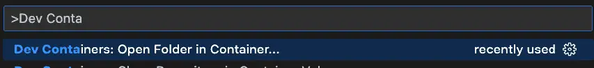
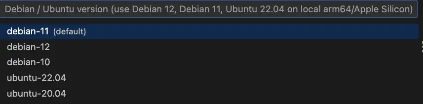
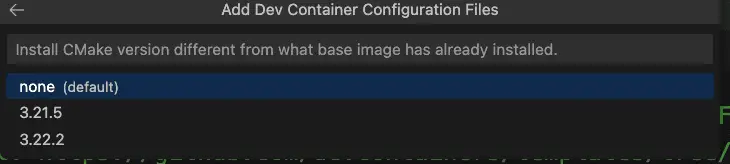
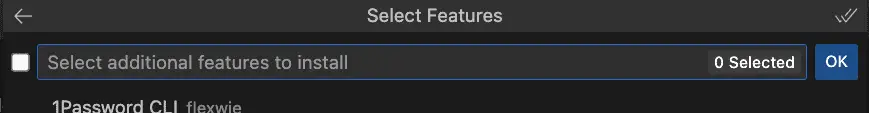
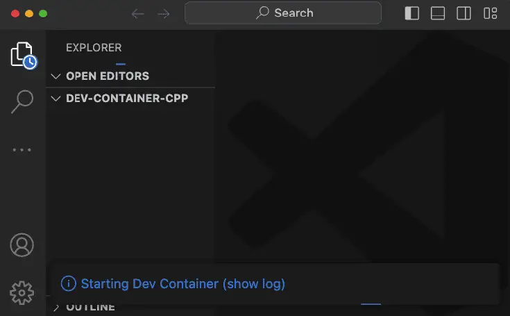
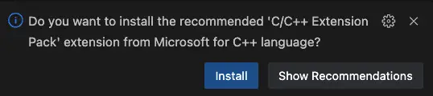
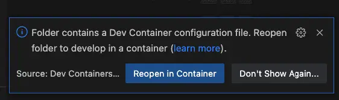
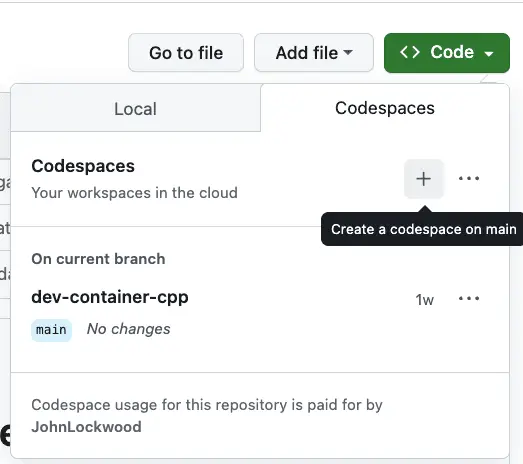
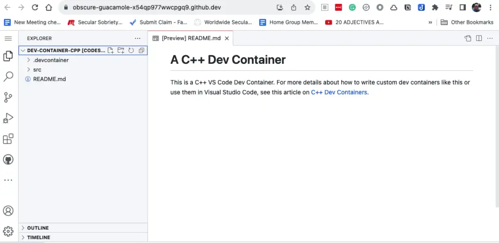

## Dev Containers in VS Code: An Introduction

Dev containers are a feature of Visual Studio Code that lets you easily develop and debug your code within a Docker container. The container can be one that "comes with" VS Code, and you can use this to develop code on any folder on your computer. This means you can run and debug code in C++, Python, TypeScript, etc., without ever installing any of the tools you need to do this (because the tools come with the container that VS Code provides).

Moreover, you're not limited to the containers that VS Code makes available. You can wrap a dev container around any container you can download from DockerHub or simply point your dev container configuration at a Dockerfile to build it on the fly. Nor are you limited to running the code on your machine. By adding a few files to any repository, anyone with access to your GitHub repository can work on your repository -- either locally inside a dev container or online using Visual Studio CodeSpaces. By doing this, you don't need to document paragraph after paragraph of steps for setting up the development environment -- because you've already configured it for them! (That was nice of you).

## Dev Containers for C++: A Special Case

As you can see from the discussion above, I'm a big fan of dev containers. In the case of C++, dev containers are especially useful since even those who love C++ admit that their packaging and build tools are a complete mess compared to other languages. The Reddit post, "What's the hate for CMake all about? Is CMake really that bad?" was upvoted 201 times. Nothing in the C++ world is as useful and simple as Cargo is to Rust developers, or pip for Python, or npm for JavaScript -- well, I could go on, but you get the picture.

For example, I recently wanted to see how to integrate Boost with CMake. In an earlier [CMake Starter Project](https://codesolid.com/cmake-starter-project/ "CMake Starter Project") article, I showed how -- for certain packages -- one can simply use CMake's FetchContent module to make CMake behave almost like a real dependency manager (albeit an overengineered one). This technique failed spectacularly for Boost.

Perhaps I'd been away from C++ so long that I began to romanticize it somewhat. I failed to recall the true horror -- the fire and brimstone, the wailing and gnashing of teeth -- that awaited me in the hell of C++ dependency management.

Well, we could start using Conan, I suppose, but let's try to stick to CMake for now. Tools like FindBoost and even find\_package in CMake assume that you've already got the package installed somewhere on your system, so how do we do that? We can use the system's package manager or Boost's recommended: "download this archive and install using bootstrap shell script". If we want to automate our work, either of these alternatives requires some consistent, non-Cmake process to automate setting up an environment.

Setting up a complex environment in a reliable way is exactly what containers do well. Dev containers are especially suited to C++ because they fit the case that C++ handles so poorly, i.e., it helps us automate all those steps we have to do before building anything because our tooling is so bad.

Hopefully, by now, you're anxious to learn more about how you can use dev containers in your C++ work, but before we get to the rest of the article, let me caution you that dev containers won't let you test your code on both Windows and Linux containers. Windows containers are not supported by the VS Code dev containers feature. However, if that's not a dealbreaker for you, read on to see what dev containers can do.

## Two important dev container extensions in VS Code

Before we start working with C++ dev containers, let's go ahead and grab the Dev Containers and CodeSpaces extensions. You can search for and install these in the extension window, but a quick way to do it is to run this in your terminal:

```bash
code --install-extension ms-vscode-remote.remote-containers
code --install-extension GitHub.codespaces
```

The first one is named "remote-containers", but that's also the dev containers plugin.

With these extensions installed, there are now at least two paths you can take:

- To run Dev Containers locally, you'll need to have Docker installed. If you don't, see Docker's [Getting Started](https://www.docker.com/get-started/ "Getting Started") page for installer downloads and instructions.

- Even without Docker on your local machine, you can still take advantage of CodeSpaces, which we'll also discuss shortly.

## Quick Start: A "Default" C++ Dev Container

Assuming you have both Docker and the dev containers extension installed, you can easily open any folder on your machine in a default C++ dev container. Here are the basic steps you can use to do this. (It's fairly intuitive once you've gone through it once).

First, in VS Code's Command Palette (CTRL-SHIFT-P on Windows and Linux / CMD-SHIFT-P on a Mac), start typing "dev" to bring up the dev containers extension option. The selection you want is "Dev Containers: Open Folder in Container":



You'll be prompted for a folder to open. I recommend using an empty folder. Select the folder you want, and you'll next be prompted to select a container configuration template. Here, just type "C" to find the C++ dev container.


Next, you'll be prompted for an OS type. The default is fine.



Next, if there are other CMake options visible, just select the default here.



At the next step, you'll be prompted to install additional tools. We'll skip those and just click OK.



What will happen next is that VS Code will start launching your dev container in a new window. It will take a few seconds to start up. Here's that window (I've made it smaller for the screenshot, of course):



When that startup message goes away, you'll be in a full-featured development environment running in a container on your machine. Behind the scenes, VS Code mounted a volume to the local directory you selected, so any work you save here will also be saved in your local directory. The tools you need to work in C++ have mostly been installed for you. Let's add a C++ file to test things out:

```cpp
// hello.cpp
// compile and run with:
// g++ hello.cpp -o hello && ./hello

#include <iostream>

int main(int argc, char* argv[]) {
    std::cout << "Hello, world!" << std::endl;
    return 0;
}
```

Once you add that file to the directory, VS Code will suggest you add the C++ extension, and I recommend clicking yes to install it.



With that extension installed, the F5 key will allow you to select "Build and debug active file". Here it is with a breakpoint set:


I realize that in a world of generative AI and other distractions, the ability to spin up a complete, ad-hoc development environment using tools you probably already have on your machine may not impress you quite as much as it does me. However, as someone who once installed a professional C++ compiler and IDE that came on twenty-two 3.5" floppies, I think it's pretty cool. (Apologies for the "old-guy-who-walked-uphill-both-ways" story.)

Before we look into how to further customize dev containers, we should point out that you only have to do the steps above for a given directory once. Because of the stored configuration in the .devcontainer folder, the next time you simply open the folder as you normally would, VS Code will prompt you to re-launch it in a dev container.



## Creating a Custom Dev Container

If you explore what comes with the default C++ dev container, you'll see it has a number of features. In addition to a basic Linux development environment, it also installed Git and CMake, for example. However, there is room for improvement:

- Chances are the version of CMake and Gcc are not the latest. Both programs are several versions behind the latest. This is likely true of other programs. At the time of this writing, for example, the version of CMake does not yet include the latest CMake experimental features for C++ modules, for example.

- Anything else we want to add will need to be done manually, defeating the purpose of a shared, automated development environment.

- We noticed we were prompted to install the C++ Extension Pack. Since we know C++ is what we want, we might want to make this and some other helpful extensions available automatically.

- You may want to automate other customizations when the container is built.

With this in mind, let's turn now to how to create a custom dev container. I believe the best way to do this is to start with a newly created repository on GitHub. Create the repository as you normally would, using either the GitHub site or the GitHub CLI. (We'll discuss the files you'll be adding below, but if you'd prefer to simply forck a repository that has these files already, they are in [this repository](https://codesolid.com/cpp-dev-containers/ "this repository").)

First, in the root of the directory, add a directory named ".devcontainer". (Make sure you include the period symbol at the beginning of the name; this is a "hidden" directory). Then add the following files:

```docker
# Dockerfile
FROM ubuntu:23.10

COPY packages.txt /tmp/

RUN apt-get update && export DEBIAN_FRONTEND=noninteractive \
    && apt-get -y install $(cat /tmp/packages.txt)

# [Optional] Uncomment this section to install additional vcpkg ports.
# RUN su vscode -c "${VCPKG_ROOT}/vcpkg install <your-port-name-here>"
```

This is pretty minimal -- we copy a file containing the packages we want to install, then use apt-get to install them. We should point out that this container is for development purposes only and should not serve as the basis for a production build (not least because the default Ubuntu containers run as root).

Here is the package list (packages.txt) we used, but naturally, you can make different selections:

```
build-essential
git
cmake
meson
```

Build-essential gets us gcc and Gnu Make, while CMake and Meson are two alternative C++ build systems. (CMake is the _de facto_ standard; Meson is optional but well regarded).

Finally, we'll add some custom configurations to what is otherwise a fairly "standard" devcontainer.json file:

```json
// For format details, see https://aka.ms/devcontainer.json. For config options, see the
// README at: https://github.com/devcontainers/templates/tree/main/src/cpp
// For more information about this particular Dev Container, see the article
// on C++ Dev Containers at: https://codesolid.com/cpp-dev-containers/
{
	"name": "My Custom C++ Dev Container",
	"build": {
		"dockerfile": "Dockerfile"
	},

	// Features to add to the dev container. More info: https://containers.dev/features.
	// "features": {},

	// Use 'forwardPorts' to make a list of ports inside the container available locally.
	// "forwardPorts": [],

	// Use 'postCreateCommand' to run commands after the container is created.
	// "postCreateCommand": "gcc -v",
	"customizations": {
		"vscode": {
			"extensions": [
				"ms-vscode.cmake-tools",
				"ms-vscode.cpptools",
				"ms-vscode.cpptools-extension-pack",
				"ms-vscode.cpptools-themes",
				"ms-vscode.makefile-tools"
			]
		}
	}

	// Uncomment to connect as root instead. More info: https://aka.ms/dev-containers-non-root.
	// "remoteUser": "root"
}
```

Under customizations, we've included several handy VS Code extensions that we want to have available when the dev container launches in VS Code. These will help us work with the system packages we've installed automatically.

Here we're still relying on the Dockerfile to start our container, but it's also possible to use this Dockerfile and packages.txt file to build the container, push it to DockerHub, and rely on a pre-build container instead. In this case, we'd replace this section:

```json
"build": {
		"dockerfile": "Dockerfile"
	},
```

With something like

```json
 // Update the 'image' property with your Docker image name.  "image": "registry_name/your_account_name/path/image:tag",
```

Whether you keep it as is or push an image, you can launch it locally using the dev container extension, as we've shown above. Alternatively, you can push the code to GitHub and launch it in GitHub CodeSpaces. We'll do that next.

## Using a Dev Container in GitHub CodeSpaces

Once you've pushed your .devcontainer-enabled repository to GitHub, you (or anyone logged into a GitHub account if it's a public repository) can open it and start developing easily without _cloning the repository_. To see this in action, simply sign in to GitHub and navigate to [https://github.com/CodeSolid/dev-container-cpp](https://github.com/CodeSolid/dev-container-cpp).

Once there, click the Code button, then navigate to the Codespaces tab, and use the + button to create a CodeSpace.



After a few moments, you'll see a complete VS Code development environment running in your browser.



Note that even though I own this repository, you'll be running CodeSpaces under your own account (even if you haven't forked. the repository). You currently get 100 CPU hours with a free account, but since the default configuration uses 2 CPUs, this works out to 50 free hours per week. Because of this, when you're finished with a Codespace, it's a good habit to stop it before you browse away. To do this, search for and select "Codespaces. Stop Current Codespace" in the Command Palette.

Note that stopping it simply makes it inactive, so you won't be billed for CPU time. You can return to it any time by clicking on your profile icon and navigating to "Your Codespaces". This will show the Codespaces you've used recently.
