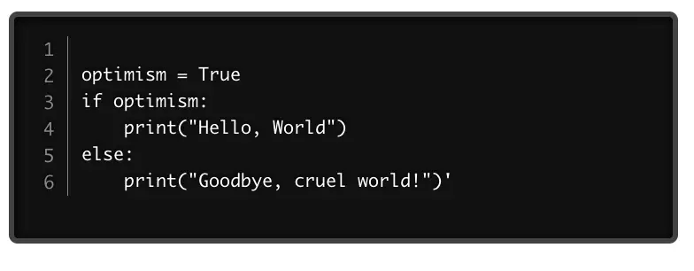

I recently did some exploratory coding on how to run Pyodide in a web application. I admit it was (and is) fairly slow going, but I wanted to share some preliminary results. To give you some background, if any of these pieces are new to you, for some time now, it's been possible to run Python in a browser based on Pyodide, a port of CPython to WebAssembly. Several popular projects are based on this, including Jupyter Lite, which forms the basis of our own [online Python portal](https://jupyter.codesolid.com/lab/index.html?path=index.ipynb) based on JupyterLite, and PyScript, a Pyodide add-on that makes it somewhat more accessible for web developers.

The reason for this is that I'm a firm believer in coding exercises as the best way to 1) learn your first language or 2) come up to speed in a new one. For example, some time ago, I practiced my Node.js through the meme-friendly [Learn You The Node.js For Much Win!](https://github.com/workshopper/learnyounode) Similarly, Rust has [Rustlings](https://github.com/rust-lang/rustlings), a tool I found finally broke through the cognitive cloud of O'Reilly's _Programming Rust_. Finally, one of the cool things about the [Exercism](https://exercism.org/) platform is that the exercises can be downloaded and submitted via the website or a command-line tool.

## Clearing a Roadblock

Before working with Pyodide, I wanted to find an online editor plugin with syntax highlighting. In the JavaScript world, one popular library that supports this is Prism. Since I had some experience with Vue.js, I spun up a Vue sample and installed a few Prism plugins without much success, so I decided to try it out on React. My first step was to create a React app based on TypeScript.

```bash
npx create-react-app my-app --template typescript
```

This done, for Prism I found the [react-prism-editor](https://www.npmjs.com/package/react-prism-editor) plugin. Here at least I was able to get the plugin working by installing the editor and the themes:

```bash
npm install react-prism-editor
npm install prism-themes
```

For now, I call my current thin wrapper around the editor with a hardcoded program to run. I decided to swap out the entire App component with PythonApp (which will become our wrapper around Pyodide). With the code to run and the call to the editor wrapper compoent, the changes to index.tsx look like this:

```typescript

import CodeEditor  from './components/CodeEditor';
import PythonApp from './components/PythonApp';

// ...

let code = `
optimism = True
if optimism:
    print("Hello, World")
else:
    print("Goodbye, cruel world!")'
`;

root.render(
  <React.StrictMode>
  <PythonApp>
    <h1>And the crowd went wild...</h1>
    <CodeEditor 
    code={code}
    ></CodeEditor>
    </PythonApp>
  </React.StrictMode>
  
);
```

As IU mentioned, the CodeEditor is a thin wrapper, but here is the code if you're curious:

```typescript
import React from 'react';
import ReactPrismEditor from 'react-prism-editor';
import './CodeEditor.css';

interface Props {code: string, children?: any}

function CodeEditor(props: Props) {
  
  return (
    <div className="CodeEditor">
    <ReactPrismEditor
    language="python"
    theme="twilight"
    lineNumber={true}
    code={props.code}
    readOnly={false}
    clipboard={true}>
  </ReactPrismEditor>
  </div>
  );

}

export default CodeEditor;
```

One problem I noticed, however, when specifying "python" as the language, no syntax highlighting appeared.



I made a mental note to submit a pull request and found the code I needed to modify in node\_modules/react-prism-editor/lib/utils/languages.js, which contains two arrays, neither one of which mentions Python. When fixed
