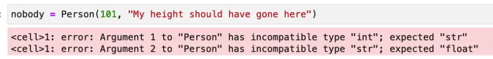
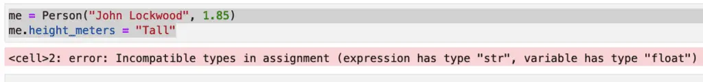

Many of the best features of Python are hidden in plain sight -- in the standard library itself. One of these excellent features is a relatively recent addition. Python 3.7 introduced a new module called dataclasses. This module provides a powerful alternative to the namedtuple class included in Python since version 2.6.

## What is the Python Dataclass Decorator?

The dataclass decorator (annotation) can be imported from the dataclasses module. The dataclass decorator gives your class several advantages. The primary benefit of the dataclass is that it can automatically add several Python methods to the class, such as \_\_init\_\_, \_\_repr\_\_and \_\_eq\_\_.

Another advantage to using the dataclass annotation instead of regular classes is that it uses type hints to understand what code to add for the methods it provides automatically. With type hints, your class starts with this extra benefit already in place, and calls to init can take advantage of lining tools such as mypi.

## Dataclass Example and Exploration Lab

This blog post will explore all the benefits of Python's dataclasses module and show you how to easily create and explore your own custom classes using the dataclass annotation. We'll also spend some time on the various default values passed to the dataclass type annotation and the overrides and customization available.

Because dataclasses are so simple to create (our example showing the default values with two class fields is just five lines of code!), we'll spend a good deal of our time exploring how they can make our Python programming tasks more straightforward. dataclass example we'll show below has a total of five lines of code

## The Advantages of Dataclasses

Before diving into our first example of a dataclass, let's take a minute to understand why we might like to use them. What, after all, is all the fuss about?

Before Python dataclasses, to add fields to standard classes, the most common method would be to create an \_\_init\_\_ method, and for each non-self parameter in init, write some boilerplate code like "self.parameter\_name = parameter\_name". Writing code like this is OK if you're learning Python, but it gets old quickly after that.

So let's say you've done that, and you've created a nifty Person class:

```python
class Person:
    def __init__(self, name, height_in_meters):
        self.name = name
        self.height_in_meters = height_in_meters
```

You decide to test it out a bit, so let's do that next:

```python
me = Person("John Lockwood", 2)
print(me)
```

Output:

```bash
<__main__.Person object at 0x123029150>
```

Wow, we've run into a couple of problems already. In the first place, I'm not that tall, but it was unclear what I was meant to be passing there, so I rounded up. I should have written a docstring or provided type hints for the init method. Also, the class doesn't know how to display itself yet, so printing an object of the class gave me an ugly default.

There are other problems, too. If I create another object with exactly my properties, shouldn't it still be me? (Sure, I realize my name and height aren't a definitive identifier, but I think I'll refrain from showing you some code with my Social Security number for now). But that doesn't happen. With apologies to #metoo, the movement:

```python
me = Person("John Lockwood", 2)
me_too = Person("John Lockwood", 2)
print(me_too == me)
```

Output:

```bash
False
```

I guess I'm just not feeling myself today.

If you learn enough about [Python dunder methods](https://codesolid.com/dunder-methods-in-python-the-ugliest-awesome-sauce/), you can solve these problems, of course, but that article link won't have every detail you need, so you'll need to hunt around a bit. That's a problem you can fix. Another worse issue that's built-in is that if you write those special methods, then change your class properties at all, they all need to be touched. \_\_every\_\_ ... \_\_last\_\_ ... \_\_one\_of\_them\_\_.

I know you don't want to waste your time doing that. Let's fix all those problems quickly with a Python dataclass annotation.

## Python Dataclass Example: Class Definition

```python
from dataclasses import dataclass

@dataclass 
class Person:
    name: str
    height_in_meters: float
```

If we add up the non-blank lines in that file, the length of the code is pretty much what it was before. However, we also get a lot of code for free. Specifically, we no longer have to hand-code the \_\_init\_\_ method or several other double-underbar (dunder or "magic") methods. Here's what you get by default:

- A typed **\_\_init\_\_** method.
- Static type checking on the **\_\_init\_\_** method. (We'll demonstrate this with mypy).
- A **\_\_repr\_\_** method, with the class name and the fields as they appear, in order. We'll show this below as we explore the results.
- A **\_\_str\_\_** method. More precisely, we don't need to implement **\_\_str\_\_** separately because the default for Python objects is to call **\_\_repr\_\_** if **\_\_str\_\_** is not implemented.
- An **\_\_eq\_\_** method. This should give us the behavior I mentioned I wanted above: two different objects with identical field values should compare as equal.
- If you're using Python 3.10 or later, a **\_\_match\_args\_\_** tuple. This will allow our class to work inside a 3.10 style match expression, which we'll dig into in a later section.

## Exploring Our Dataclass

Let's do some simple testing and other exploration based on what we learned above. Let's start with \_\_repr\_\_and see how this is looking now:

### \_\_repr\_\_

```python
me = Person("John Lockwood", 1.85)
print(me)
```

Output:

```bash
Person(name='John Lockwood', height_in_meters=1.85)
```

OK, so far, that's much nicer than earlier. Let's move on to discuss data class equality next.

### \_\_eq\_\_

In addition to displaying nicely formatted output for the class, turning the class into a data class provides a reasonable default for equality. This default is to compare all fields in order, so for fields with a unique identifier, one can hand-code it (see the section below on "Understanding and Using Dataclass Defaults"). Another reasonable and lazy option would be to push the unique identifier (email address, employee ID, or what have you) to the first field in the class. Of course, neither option would correctly identify cases of violation of key uniqueness, nor should we expect it to do so.

```python
me = Person("John Lockwood", 1.85)
me_too = Person("John Lockwood", 1.85)
print(me_too == me)
```

Output:

```bash
True
```

### Dataclass Static Type Checking With MyPy

As we mentioned earlier, dataclasses rely on Python type hints to define an instance variable. This gives us the fringe benefit that we can now statically type check our objects at construction time or whenever we assign a value to a field.

We can validate this in Jupyter Notebook, for example, using `pip install nb_mypy`, then in the notebook itself, `%load_ext nb_mypy`. The nb\_mypy extension automatically checks code as it's run in a cell. For example, using the non-dataclass Python class I originally wrote, I could have swapped the arguments for name and height or otherwise used an incompatible type. With the original class in scope, this code runs just fine (even though it constructs an object that makes no sense):

```python
nobody = Person(101, "My height should have gone here")
```

With the dataclass version, here's what happens:



We could have added type checking to a class without using the @dataclass decorator, but if we get it for free, that's a win, especially as the list of fields becomes longer. And yes, if you're curious, the type checking also works on variable assignments on the dataclass instance that take place outside the constructor, too:



## Dataclasses And Python Structural Pattern Matching

### Overview and Example

Match statements are a new feature of Python 3.10. This is a fantastic new feature for those who've ever longed for a switch statement in Python. The good news is we now have something, and the better news is that it's more powerful than the switch statement. Structural pattern matching borrows some ideas from match expressions in Scala and other languages. Rather than just matching simple types like integers or strings, pattern matching expressions match complex types (such as dataclasses). Consider the following example:

```python
princess = Person("Diana Spencer", 1.8)
john = Person("John Lockwood", 1.85)
george = Person("George Washington", 1.88)
rock = Person("Duane Johnson", 1.88)
              
people = [princess, george, john, "Cheese Sandwich", rock]

for person in people:
    match person:        
        case Person("John Lockwood", 1.85) as me: print(f"Found {me} by exact match.")        
        case Person(name, 1.88) as person: print(f"Found by height: {name}.")
        case Person(_,_): print("Found Lady Di!") 
```

Output:

```bash
Found Lady Di!
Found by height: George Washington.
Found John by exact match.
Found by height: Duane Johnson.
```

In this example, our match expression deals only with Person object classes. The types don't have to be homogenous, and we've included some bad data in the list to show that that's the case. We match John Lockwood on both fields on the first line after the match expression. Using an "as" expression, we capture the whole matched object to a variable and display it. In the second line, we're capturing a variable ("name") and using it to print the name of anyone we find who happens to be 6.2" tall, or 1.88 meters. The way we've coded the third line, `Person(_,_)`, anyone who's not 1.88 meters tall or John Lockwood is Lady Diana. We could have coded that line as shown in the following code:

```python
case _: print("Found Lady Di!")
```

In that case, however, we would have confused "cheese sandwich" with Lady Diana, and since that would be disrespectful, we decided to make her the default person instead.

By the way, if you're hungry and need the sandwich, this line will fetch it for you:

```python
case str() as s: print(f"Please enjoy this tasty {s}!")
```

### How Dataclasses Implement Pattern Matching

Python created the appropriate `__match_args__` member variable. It's not a function but rather is a tuple with the names of each dataclass field in our class; in this case:

```python
('name', 'height_in_meters')
```

Structural pattern matching is a powerful new tool. If your dataclass object has relatively few fields, it may be the most expressive and compact way to process something like a return value.

## Understanding and Using Data Class Default Values

We've seen how, by default, adding the dataclass annotation will implement `__init__`, `__eq__`, `__repr__`And \_\_match\_args\_\_ for you. If you don't want one or more of these, you can suppress it in one of two ways. First, you can set a named parameter to `False`, as shown below:

```python
from dataclasses import dataclass

@dataclass(init=False)
class MyClass:
    my_field: int

my_var = MyClass()
my_var.my_field = 42
```

Here is the dataclass decorator's signature, showing what arguments are available and their defaults:

```python
def dataclass(*, init=True, repr=True, eq=True, order=False, unsafe_hash=False, frozen=False)
```

The unsafe\_hash method is of limited utility, but if you're curious about them, see the full specification for dataclasses in [PEP-557](https://peps.python.org/pep-0557). We'll discuss frozen in a later section. Order can be used to add comparison methods (\_\_gt\_\_, \_\_lt\_\_, etc.). It makes sense to discuss this in the context of field customization, so we'll do that in a later section.

The second method to turn off a default value is to implement the function in question since (generally speaking) the dataclass annotation won't implement a method for which it sees a definition. To prove this to yourself, you might try implementing a `__eq__` function on height\_in\_meters. After all, who _wouldn't_ want to make Duane Johnson equal to George Washington?

## Dataclass vs. Namedtuple

In PEP-557, there's an entire section entitled "Why not just use namedtuple?". I won't quote that at length here, but to summarize:

- Nametuple comparisons to tuples will sometimes display false positives, so they're not type-aware.
- The fact that tuples are iterable makes it challenging to add fields if users have used tuple unpacking.
- Lack of control over the methods like \_\_init\_\_, \_\_repr\_\_, etc. (We've already discussed how dataclass gives you flexibility here).
- Poor support for inheritance.
- No option for making classes mutable.

The last point begs the question -- if we can't make namedtuple instances mutable, how about dataclasses? Do we have some flexibility there? Yes, we do! Dataclasses are mutable by default, and although immutability as a guarantee is problematic in user-defined Python classes, we can certainly get close enough for all practical purposes with the simple addition of frozen=True to our decorator argument list.

For example:

```python
from dataclasses import dataclass
@dataclass(frozen=True)
class Point:
    x: int
    y: int

p1 = Point(10, 200)
p2 = Point(19, 10)

# Modifying fields is not allowed.
# This line gives: "FrozenInstanceError: cannot assign to field 'x'"
# p1.x = 5 

# We can now use points where we need immutable values, e.g., dictionary keys
vals = {p1: "point1", p2: "point2"}
print(vals)

print(f"Hashes, p1: {p1.__hash__()}, {p2.__hash__()}")
```

Output:

```bash
{Point(x=10, y=200): 'point1', Point(x=19, y=10): 'point2'}
Hashes, p1: 238092144646713039, 9078147046843256684
```

## Dataclass Fields

As we've seen, a Python dataclass features a high degree of flexibility in overriding arguments and substituting custom magic methods. In addition to flexibility at the class level, developers can also customize the behavior of fields.

### Simple Field Customization: Overriding a Default Value

For example, consider the following dataclass example, where we suppress the output of a password for the user class by omitting it from the \_\_repr\_\_ method. (Strictly speaking, a repr method should initialize a class, but in this case, we may feel that keeping passwords out of the log is more critical than writing canonical Python).

```python
from dataclasses import dataclass, field

@dataclass 
class User:
    email: str
    password: str = field(repr=False)

player_one = User("ready_player_one@example.com", "secret123")
print(player_one)
```

Output:

```bash
User(email='ready_player_one@example.com')
```

Player one's password is neither super-secure nor hashed, but we've kept it out of the logs at any rate!

We can also exclude a dataclass field from comparison methods

We can also omit certain fields from the `__init__` method while retaining the ability to set it on an instance of the class. Optionally, if we've moved it out of `__init__`, we can still construct it using a special syntax provided by dataclasses for calculated fields.

### Post Init Processing

If an `__init__` dunder function is created by the dataclass annotation it will call a special method called \_\_post\_init\_\_ if one is defined. We can use this together with passing False as the init parameter to a field to create a custom field.

Consider the following code for calculating a defined field during object instantiation:

```python
from dataclasses import dataclass, field

@dataclass
class Rectangle:
    length: float
    width: float
    area: float = field(init=False, repr=False)

    def __post_init__(self):
        self.area = self.length * self.width


couch = Rectangle(length=6.0, width=3.0)
print(f"A {couch} has area {couch.area}.")
```

Output:

```bash
print(f"A {couch} has area {couch.area}.")
```

### Excluding Fields from Ordering

We mentioned earlier that one of the other defaults for data classes is the order parameter; the default parameter is `False`. If set to true, it enables comparing objects, but the default ordering of comparing all the fields as though they were an ordered tuple may not be what you want. We can exclude a field from ordering by using `compare=False` as an argument to the field function.

Consider, for example, the following simple code:

```python
from dataclasses import dataclass, field

@dataclass(order=True, init=True)
class PersonByHeight:
    name: str = field(compare=False)
    height_in_meters: float
    

abe = PersonByHeight("Abe Lincoln", 1.93)
john = PersonByHeight("John Lockwood", 1.85)

print(f"abe > john: {abe > john}")
```

Output:

```bash
abe > john: True
```

The code above requires some explanation. First, by overriding the default value of `sorted=False` on the class and setting it to True, we implement comparison operators. Behind the scenes, that's done by implementing the magic methods `__lt__`, `__le__`, `__gt__`, and `__ge__`.

Next, we further customize by overriding the default value of `compare=True` for the name field by setting it `False`. This excludes it from the methods mentioned above.

Without this field-level customization `abe > john` would be `False`, because "John Lockwood" is greater than "Abraham Lincoln", at least lexicographically. Abe Lincoln was taller than me, however, so I was able to make the comparison flip the other way by excluding the name and making height the basis for it.

I don't know if you happened to notice the same quirk that I did in the implementation, so I'll point it out. I'm not sure what use cases the authors had in mind, but it seems to me that it would have been more useful to choose the fields to _include_ in the ordering. This is because the far more common use for ordering is to base the default ordering on a small number of properties.

This is common everywhere: seniority is ordered by start date, and whether Forbes cares about you is ordered by net worth. Presidents and Python bloggers are compared by height, etc. For a small person class, it didn't matter much but imagine if the field had twenty attributes. If the default parameter for the field type were `compare=False`, you would only have to add `compare=True` once to compare based on a field. Because the default is True, however, to compare a class instance with another class based on a single field, you'd have to add `compare=True` nineteen times.

In fairness, perhaps the idea here was that because it's trivial to write `abe.height_in_meters > john.height_in_meters`, perhaps the idea was to handle the less common but more difficult to code case of simply excluding a small number of fields. The folks maintaining Python generally have to give that sort of thing a lot more thought than those of us who merely blog about it, so perhaps I'm just missing some hidden wisdom here.

## Should I Use a Python Dataclass: Maintenance

As we alluded to earlier in our discussion of dataclass vs namedtuple classes, one of the advantages of Python dataclasses is their ease of maintenance compared to nameduple. I believe that their maintainability more generally speaking is one of their core advantages. To be sure, you can add \_\_init\_\_ and \_\_repr\_\_ to your class manually, and many Python developers will tell you they've done it repeatedly.

Structural pattern matching is a newer feature, so I for one haven't experimented much with `__match_args__` except for seeing it in this article, but I'd like to dig into pattern matching in a follow-on to this article, so we can examine it there together.

The point here is not that dataclasses give you features that you can't hand-code yourself. The point is that if you do hand-code them yourself, you need to hand-re-code them every time something new gets added to the class. In some cases that may not happen often, but in the world of business application development especially, new requirements are an everyday occurrence! And even if you don't do it often, adding a field in one place is more "DRY" and more convenient than adding it in all the places that dataclasses give you for free.

The answer to whether you should use a Python dataclass is a resounding yes. Ease of maintenance is one reason. Moreover, with typed fields, so your code becomes easier to understand. Finally, dataclasses implement the tedious tasks of class development consistently and with less code.
