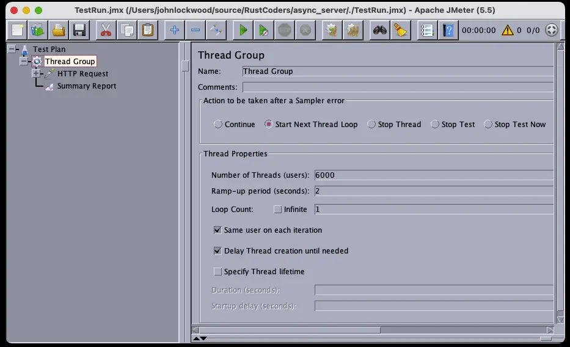
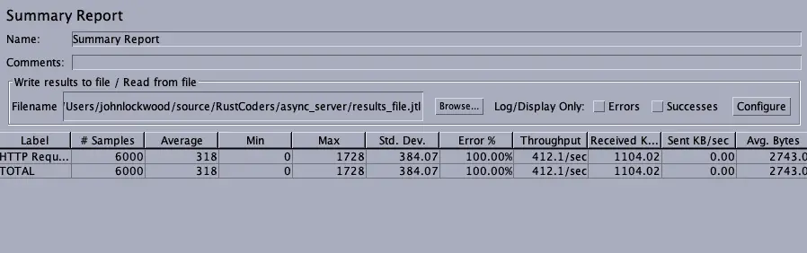

I recently spent some time exploring two asynchronous web frameworks -- one in Rust and one in Python -- and doing some benchmarks between the two. In both cases, I tried to select the "best-of-breed" choice in terms of performance. For Rust, I chose Axum, a Tokio-based framework familiar to me from my earlier article on [Rust JSON and Data Serialization](https://rustassured.com/serializing-in-rust-json-web-forms-and-more-with-serde/). In Python, I selected Blacksheep as a framework and Uvicorn as the web server.

Benchmarks are often challenging to set up and interpret. With this in mind, I was hoping for a straightforward result that would vindicate what we all know: Rust is blazingly fast and runs circles around Python in terms of performance.

As challenging as they can be, however, Benchmarks are really useful and fun. They're especially amusing in cases where they have a somewhat surprising result, as they did in this case. Rust did have an edge in every instance that didn't depend on outside library support (where the library itself might be better optimized in Python). However, the differences in some cases were not substantial.

Before we get into the detailed result section, however, let's take a look at the load testing tool we'll be using and the code we tested. The source code and the test case for this article are in this [async\_server](https://github.com/RustCoders/async_server) repository, and we'll go over it below.

## Using JMeter (A Brief Introduction)

Apache JMeter is a Java application that allows you to simulate heavy loads on a server. You'll need Java 8.0 or later installed to run it. Once you download and unzip the binaries, you want to run JMeter from the bin directory or create a shell script to point to it. For example, to run the test file from the source without launching the JMeter GUI (which makes it slightly faster), I used the following script.

```bash
$HOME/apache-jmeter-5.5/bin/jmeter -n -t ./TestRun.jmx 
```

Removing the "-n" opens the same test in the GUI, where you can experiment with different settings, including how many users should call the endpoint, the ramp-up time so all the users won't start at exactly the same instant, etc. This is done by a Thread Group to the test tree and configuring it:



Here we're adding 6,000 users with a fairly aggressive 2-second ramp-up. As you can see, beneath the thread group, we've added two items, an HTTP Request, and a summary report. Drilling into the HTTP request, we see this on the right-hand pane:


Here we're testing against localhost on port 3000, and we're testing the /async endpoint (which we'll meet in a moment). We change this endpoint to run different tests as needed.

Finally, here's a summary report from a typical run:



Similar summary information appears in the terminal when we run JMeter without the GUI.

## The Rust Application

If you're new to Rust, the best way to install it is by using the Rustup tool. Assuming you have it installed, you can run the following command in an empty directory to set up a basic Rust executable project:

```bash
cargo init .
```

That done, we need to replace two files. Cargo.toml is our build file in the root directory, listing the project's packages. (Python developers may think of it as analogous in some respects to requirements.txt).

```toml
[package]
name = "async_server"
version = "0.1.0"
edition = "2021"

[dependencies]
axum = "0.6.12"
tokio = { version = "1.27.0", features = ["full"] }
```

The second file to replace is our main source file, src/main.rs. Here is the source we'll be running.

```rust
// src/main.rs

use axum::routing::{get};
use axum::{Router};
use std::net::SocketAddr;
use tokio::time::{sleep, Duration};

fn fibonacci(max: i32) -> Vec<i32> {
    let mut a = 1;
    let mut b = 1;    
    let mut temp: i32;
    let mut numbers : Vec<i32> = Vec::new();
    while a <= max {
        numbers.push(a);
        temp = a;
        a = b;
        b = temp + b;
    
    }
    numbers
}

// Simply delay for 2 ms (optionally), and return a result
// This function tests raw async performance with  
// almost no CPU activity going on.
//
// served at http://localhost:300/async
async fn test_async() -> &'static str {
    // So we can run with/without a delay w/o
    const SHOULD_DELAY : bool = true;

    if SHOULD_DELAY {
        const DELAY_MS: u64 = 2;
        sleep(Duration::from_millis(DELAY_MS)).await;
    }
    "OK"
}

// Give the CPU a little more to by generating the first few fibonacci numbers
// Note that as large as that number seems, it only runs the loop in the fibonacci
// function < 50 times.
async fn test_fibonacci()-> &'static str {
    let numbers = fibonacci(100000000);

    // Prevent compiler optimizing the call away
    if numbers[0] == 1 {
    "OK"
    }
    else {
        "?"
    }
}

#[tokio::main(flavor = "multi_thread", worker_threads=1)]
async fn main() {
    // set up
    let app = Router::new()
        .route("/async", get(test_async))
        .route("/fibonacci", get(test_fibonacci))
        .with_state(());

    // run it
    let addr = SocketAddr::from(([127, 0, 0, 1], 3000));
    println!("listening on {}", addr);
    axum::Server::bind(&addr)
        .serve(app.into_make_service())
        .await
        .unwrap();
}
```

Finally, to run the server application, we created the simple shell script below, mainly so we wouldn't accidentally forget the --release switch. Running it in debug mode might slow things down.

```bash
cargo run --release
```

## Discussion

As you can see, the main method currently runs the multi-threaded Tokio runtime with a single worker thread. (Tokio is the most popular async runtime for Rust applications). For most of the testing we've done, this turned out to be somewhat more efficient than either running with a higher value or using the default setting (which would select a number of worker threads to match the number of cores on the computer). It may be that this somewhat counterintuitive result is partly due to the fact that we're running JMeter on the same machine as the server, so the results you see in a more "representative" test scenario with the server running independently might differ.

Our main method sets up our routing and runs the Axum server. We have two routes, each of which has a handler that's defined as an asynchronous function.

The first route, `/async`, calls a function that simply delays for 2 milliseconds and returns, which is roughly comparable to what we might find in a CRUD application that needs to wait on the result of a database query.

The second route, `/fibonacci`, calls a function to give the CPU a little more to do, finding the Fibonacci numbers under 100 million. Because of the way Fibonacci numbers work, that only returns 39 values, with the highest one being 63,245,986. (A more dramatic CPU-bound test might be to calculate the first N prime numbers, for example).

## The Python Application

The Python application is designed to make switching back and forth between it and the Rust application easy, so you'll see it is pretty much the same application, but this time is written in Python. We ran this using Python 3.11, and if you're running Conda, we included the conda environment file in the source. We installed Blacksheep and Uvircorn into this environment using Pip:

```bash
pip install blacksheep==1.2.12
pip install uvicorn==0.21.1
```

With that in place, here is the code for the same web application we saw above in Rust, this time using Python and Blacksheep:

```python
# app.py

from blacksheep import Application
import asyncio
app = Application()

def fibonacci(max):
    numbers = []
    a = 1
    b = 1
    while a <= max:        
        numbers.append(a)
        temp = a
        a = b
        b = b + temp
    return numbers


@app.route("/fibonacci")
async def test_fibonacci():
    numbers = fibonacci(100000000)
    if numbers[0] == 1:
        return "OK"
    return "?"

@app.route("/async")
async def test_async():
    await asyncio.sleep(.002)
    return "OK"
```

Although the endpoints are the same, you'll notice that in the Blacksheep case, we don't actually run the server from within the code. Instead, we pass the app.py module to Uvicorn, which runs the application for us. Once again, we add this to a simple shell script:

```bash
uvicorn --no-access-log --port 3000 app:app 
```

We override the default Uvicode port to make it consistent with the Rust application. One switch that's important here is the --no-access-log setting. Without it, we'd be logging every request to STDOUT, which in itself would slow the application fairly dramatically. Since the Axum server doesn't do this by default, we disable it here to make it a fair comparison.

Now that we've gone over the test setup and the two server applications under test, we're ready to discuss the results.

## Test Results

For both the /async and /fibonacci endpoints, we tested with 6,000 users and a two-second ramp-up. This is a fairly aggressive load, and both Rust and Python took some time to process all 6,000 requests.

### Async Function With 2ms Delay

The table below shows the results of three runs against a warm server (i.e., we discard the first run). These results are against the endpoint that simply waits for two milliseconds. As you can see, Rust has a slight edge in this case. However, because the default Uvicorn install is Cython-based, the edge is perhaps not as dramatic as one might expect.

<table><tbody><tr><td></td><td><strong>Python</strong></td><td></td><td><strong>Rust (1 worker thread, MT)</strong></td><td></td></tr><tr><td></td><td>Avg RPS</td><td>Error</td><td>Avg RPS</td><td>Error</td></tr><tr><td>Run 1</td><td>365</td><td>1.82%</td><td>475</td><td>3.77%</td></tr><tr><td>Run 2</td><td>791</td><td>0.00%</td><td>628</td><td>0.00%</td></tr><tr><td>Run 3</td><td>452</td><td>8.50%</td><td>625</td><td>0.00%</td></tr><tr><td><strong>AVERAGE</strong></td><td><strong>536</strong></td><td><strong>3.44%</strong></td><td><strong>576</strong></td><td><strong>1.26%</strong></td></tr></tbody></table>

## Fibonacci Numbers -- Async Handlers That Are (Lightly) CPU-Bound

Next, we consider the case where we add even a relatively small amount of CPU processing into the mix. Here are the results:

<table><tbody><tr><td></td><td>Python</td><td></td><td>Rust (1 worker thread, MT)</td><td></td><td>Rust (4 worker thread, MT)</td><td></td></tr><tr><td></td><td>Avg RPS</td><td>Error</td><td>Avg RPS</td><td>Error</td><td>Avg RPS</td><td>Error</td></tr><tr><td><strong>Run 1</strong></td><td>1,321</td><td>1.15%</td><td>829</td><td>0.00%</td><td>1,821</td><td>0.00%</td></tr><tr><td><strong>Run 2</strong></td><td>430</td><td>1.67%</td><td>1,493</td><td>0.00%</td><td>534</td><td>3.88%</td></tr><tr><td><strong>Run 3</strong></td><td>1,285</td><td></td><td>1,817</td><td>0.00%</td><td>1,074</td><td>0.00%</td></tr><tr><td><strong>AVERAGE</strong></td><td>1,012</td><td>1.41%</td><td>1,380</td><td>0.00%</td><td>1,143</td><td>1.29%</td></tr></tbody></table>

In the CPU-bound case, Rust's advantages become more apparent. Interestingly enough, however, since we're only giving the CPU "something to do but not a lot to do," the best performance comes from a single worker thread (in addition to the one thread for the server itself). This is also the configuration where we encountered the fewest errors.

## Closing Thoughts

In any series of performance numbers, one can always find something to criticize. For language partisans intent on proving the case for their personal favorite, however, this is a feature and not a bug. Python fans could well look at these numbers as a vindication. On this side of the argument, one might point out that Rust only came out seven percent ahead in the pure /async case, so that, plus the difficulty of hiring Rust developers who are both able and willing to do web work, might lead you to select Python as the tool of choice. Python supporters might further make the point that if the application is going to be heavily CPU bound, an Asynchronous server is not the best choice of tool.

An obvious counterpoint that Rust fans could make is that if true parallelism is needed, Python's not the right choice in any case. In addition, although it's nice to envision thin async servers that simply return database results, in practice, the need to run business rules as well as the code one writes because one simply didn't think of that use case when the application was written mean that applications don't remain purely asynchronous for very long. The more your web server needs to run such code, the more performance matters, especially at scale. Whether such a performance increase justifies foregoing the simplicity of Python, however, is a matter each team should consider carefully.
