Table of Contents

- [What is Python Datetime?](#htoc-what-is-python-datetime)
- [Converting Strings to Datetime Objects](#htoc-converting-strings-to-date-and-time-objects)
- [Python Datetime Format Codes](#htoc-python-datetime-format-codes)
- [String to Datetime Object](#htoc-string-to-datetime-object)
    - [Accessing Datetime Objects' Elements](#htoc-accessing-datetime-object-s-elements)
    - [Datetime and Time Zones](#htoc-datetime-and-time-zones)
- [String to Date Object](#htoc-string-to-date-object)
    - [Presenting Date Objects in Different Formats](#htoc-formatting-dates)
- [String to Time Object](#htoc-string-to-time-object)
    - [Presenting Time Objects in Different Formats](#htoc-presenting-date-in-different-formats)
- [Converting a Pandas Column to Datetime](#htoc-datime-constant)
- [Converting a String to Datetime Using Other Python Libraries](#htoc-converting-a-string-to-datetime-using-other-python-libraries)
    - [String to Datetime with Dateutil](#htoc-string-to-datetime-with-dateutil)
    - [String to Datetime with Maya](#htoc-string-to-datetime-with-maya)
    - [String to Datetime with Arrow](#htoc-string-to-datetime-with-arrow)
- [Converting Datetime Back into Integer, Float, or Strings](#htoc-converting-datetime-back-into-integer-float-or-strings)
- [Conclusion](#htoc-conclusion)

Working with dates and times can be tricky, but Python makes it manageable.

The dates and times can be represented in various forms, and one of the most convenient is strings. However, we need to convert this string data into DateTime objects to work with these dates and times for arithmetic manipulations like finding time differences, adding or subtracting time, and more.

This tutorial will look at converting a string date and time to a DateTime object in Python using the Datetime module. In addition, we'll also understand the behavior of date and time in different time zones and learn about different output types of date and time objects.

## What is Python Datetime?

The primary method we will use is the [DateTime](https://docs.python.org/3/library/datetime.html#strftime-strptime-behavior "DateTime Module Documentation") module. Datetime is a built-in Python module that provides functions to handle many complex functions related to date and time.

The DateTime module has three basic types of objects: date, time, and datetime.  
Date works with dates, time works with time, and datetime works with both dates and times.

## Converting Strings to Datetime Objects

Python strptime() is a built-in method of the DateTime class that converts a string of date and time into DateTime objects.

Its syntax is as follows:

```python
datetime.strptime(date_string, format)
```

")

Here both arguments are required and must be strings.

**date\_string** \- the date (can be time as well) represented in string format.

**format** \- the data represented in datetime format, which is converted from date\_string with this function.


If no format string is specified, it defaults to "%a %b %d %H:%M:%S %Y."  
If the input string does not match the provided format, the ValueError occurs.

## Python Datetime Format Codes

Before converting the date and time string to DateTime, let's look at a fundamental concept: formatting codes.

Dates have a default representation - DD/MM/YYYY, for example, but we can output them in a particular format using different format codes.

Each formatting code represents a different part of the date/time, such as day, month, year, day of the month or week, and so on.

Below is a list of date and time formatting codes:

<table><tbody><tr><td class="has-text-align-left" data-align="left"><strong>Directive</strong></td><td class="has-text-align-left" data-align="left"><strong>Meaning</strong></td><td class="has-text-align-left" data-align="left"><strong>Returns</strong></td></tr><tr><td class="has-text-align-left" data-align="left">%a</td><td class="has-text-align-left" data-align="left">Abbreviated names of weekdays</td><td class="has-text-align-left" data-align="left">Sun, Mon, ... , Sat</td></tr><tr><td class="has-text-align-left" data-align="left">%A</td><td class="has-text-align-left" data-align="left">Full names of weekdays</td><td class="has-text-align-left" data-align="left">Sunday, Monday, ... , Saturday</td></tr><tr><td class="has-text-align-left" data-align="left">%w</td><td class="has-text-align-left" data-align="left">Weekday as a number, where 0 is Sunday, and 6 is Saturday</td><td class="has-text-align-left" data-align="left">0, 1, 2, ... , 6</td></tr><tr><td class="has-text-align-left" data-align="left">%d</td><td class="has-text-align-left" data-align="left">Days of months as zero-padded numbers</td><td class="has-text-align-left" data-align="left">01, 02, 03, ... , 31</td></tr><tr><td class="has-text-align-left" data-align="left">%b</td><td class="has-text-align-left" data-align="left">Abbreviated names of months</td><td class="has-text-align-left" data-align="left">Jan, Feb, ... , Dec</td></tr><tr><td class="has-text-align-left" data-align="left">%B</td><td class="has-text-align-left" data-align="left">Full names of months</td><td class="has-text-align-left" data-align="left">January, February, ... , December</td></tr><tr><td class="has-text-align-left" data-align="left">%m</td><td class="has-text-align-left" data-align="left">Months as zero-padded numbers</td><td class="has-text-align-left" data-align="left">01, 02, 03, ... , 12</td></tr><tr><td class="has-text-align-left" data-align="left">%y</td><td class="has-text-align-left" data-align="left">Years without century as zero-padded numbers</td><td class="has-text-align-left" data-align="left">00, 01, 02, 03, ... , 99</td></tr><tr><td class="has-text-align-left" data-align="left">%Y</td><td class="has-text-align-left" data-align="left">Years with centuries as zero-padded numbers</td><td class="has-text-align-left" data-align="left">0001, 0002, 0003, ... , 2019, 2020, ... , 9998, 9999</td></tr><tr><td class="has-text-align-left" data-align="left">%H</td><td class="has-text-align-left" data-align="left">Hours (24 hours) as zero-padded numbers</td><td class="has-text-align-left" data-align="left">00, 01, 03, ... , 23</td></tr><tr><td class="has-text-align-left" data-align="left">%I</td><td class="has-text-align-left" data-align="left">Hours (12 hours) as zero-padded numbers</td><td class="has-text-align-left" data-align="left">01, 02, 03, ... , 12</td></tr><tr><td class="has-text-align-left" data-align="left">%p</td><td class="has-text-align-left" data-align="left">The local equivalent of AM/PM</td><td class="has-text-align-left" data-align="left">AM, PM</td></tr><tr><td class="has-text-align-left" data-align="left">%M</td><td class="has-text-align-left" data-align="left">Minutes as zero-padded numbers</td><td class="has-text-align-left" data-align="left">00, 01, 02, 03, ... , 59</td></tr><tr><td class="has-text-align-left" data-align="left">%S</td><td class="has-text-align-left" data-align="left">Seconds as zero-padded numbers</td><td class="has-text-align-left" data-align="left">00, 01, 02, 03, ... , 59</td></tr><tr><td class="has-text-align-left" data-align="left">%f</td><td class="has-text-align-left" data-align="left">Microseconds as zero-padded to 6 digits numbers</td><td class="has-text-align-left" data-align="left">000000, 000001, 000002, …, 999999</td></tr><tr><td class="has-text-align-left" data-align="left">%z</td><td class="has-text-align-left" data-align="left">UTC offset in the form ±HHMM[SS[.ffffff]]</td><td class="has-text-align-left" data-align="left">+0000, -0400, +1030, +063415, -030712.345216</td></tr><tr><td class="has-text-align-left" data-align="left">%Z</td><td class="has-text-align-left" data-align="left">Time zone name</td><td class="has-text-align-left" data-align="left">UTC, GMT</td></tr><tr><td class="has-text-align-left" data-align="left">%j</td><td class="has-text-align-left" data-align="left">Day of the year as zero-padded numbers</td><td class="has-text-align-left" data-align="left">001, 002, 003, ... , 365, 366</td></tr><tr><td class="has-text-align-left" data-align="left">%U</td><td class="has-text-align-left" data-align="left">Week number of the year as zero-padded numbers, where Sunday is the first day of the week</td><td class="has-text-align-left" data-align="left">00, 01, 03, 04, ... , 53</td></tr><tr><td class="has-text-align-left" data-align="left">%W</td><td class="has-text-align-left" data-align="left">Week number of the year as zero-padded numbers, where Monday is the first day of the week</td><td class="has-text-align-left" data-align="left">00, 01, 03, 04, ... , 53</td></tr><tr><td class="has-text-align-left" data-align="left">%c</td><td class="has-text-align-left" data-align="left">Date and time representation</td><td class="has-text-align-left" data-align="left">Mon Jun 14 21:30:00 2002</td></tr><tr><td class="has-text-align-left" data-align="left">%x</td><td class="has-text-align-left" data-align="left">Date representation</td><td class="has-text-align-left" data-align="left">01/14/02<br>01/14/2002<br>14.01.2002</td></tr><tr><td class="has-text-align-left" data-align="left">%X</td><td class="has-text-align-left" data-align="left">Time representation</td><td class="has-text-align-left" data-align="left">21:30:00</td></tr><tr><td class="has-text-align-left" data-align="left">%%</td><td class="has-text-align-left" data-align="left">The literal '%' symbol</td><td class="has-text-align-left" data-align="left">%</td></tr></tbody></table>

We've already looked at formatting codes, so let's get down to converting strings into the date, time, and datetime objects.

## String to Datetime Object

Let's look at an example where the string representing the date and time is in standard format (dd/mm/yyyy hh:mm:ss).

```python
#importing module
from datetime import datetime

# date string in DD/MM/YYYY HH:MM:SS format
date = "14/01/2002 21:30:15"

# checking the type of the date variable
print(date, "- type is", type(date), "\n")

# converting string to date object
date_obj = datetime.strptime(date, "%d/%m/%Y %H:%M:%S")

print(date_obj, "- type is", type(date_obj))
```

Output:

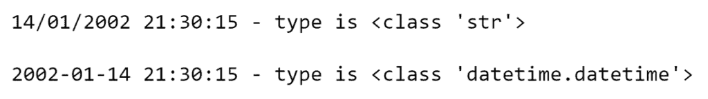

As you can see, before the conversion, the variable type was a string, which is later a datetime object.

### Accessing Datetime Objects' Elements

Using different methods, it is possible to use the datetime object elements individually.  
Let's look at the example of accessing separate parts:

```python
# using '.now()' to get current date and time
current = datetime.now()
print("Current date and time is", current)

# applying 'year' method to get year from the datetime object
print("\nCurrent year is", current.year)

# applying 'month' method to get month from the datetime object
print("Current month is", current.month)

# applying 'day' method to get day from the datetime object
print("Current day is", current.day)

# applying 'hour' method to get hour from the datetime object
print("Current hour is", current.hour)

# applying 'minute' method to get minute from the datetime object
print("Current minute is", current.minute)

# applying 'second' method to get second from the datetime object
print("Current second is", current.second)

# applying 'microsecond' method to get microsecond from the datetime object
print("Current microsecond is", current.microsecond)
```

Output:


Each datetime object element is an integer, so we can perform arithmetic manipulations.

```python
print("Type of the day element of datetime:", type(current.day))

# adding day to year
print("Addition of day to year:", current.day + current.year)
```

Output

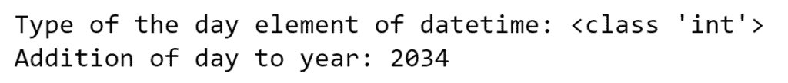

### Datetime and Time Zones

Python has a built-in pytz module to get information about the world's different time zones.

Below is an example showing how to get the current date and time in Berlin:

```python
# importing time zones module
import pytz

# using 'pytz.timezone' to get date and time of Berlin
datetime_berlin = datetime.now(pytz.timezone('Europe/Berlin'))

print("Current date and time in Berlin -", datetime_berlin)
```

Output:


The pytz object "timezone" takes the information/parameter(s) of the specific time zone we want to output.

You can use the "all\_timezones" attribute to get a list of all possible time zones in the pytz library that we can pass as parameters to the timezone.

```python
all_timezones = pytz.all_timezones

print(all_timezones)
```

Output:

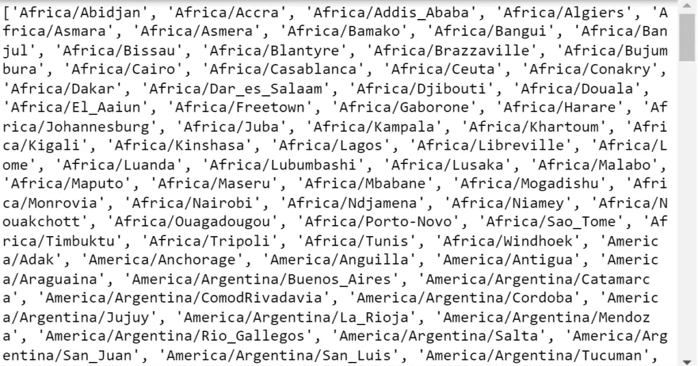

As you can see, first, we should specify the continent, then the city.

## String to Date Object

Let's now look at how to convert the same string only to a date object, that is, without the time part.

To convert a string date to a date object, we first needed to convert the string to a datetime object using strptime(), as we have already did in the example above.  
Then we have to use datetime.date() to extract only the date object part from the datetime instance.

```python
#importing module
from datetime import datetime

# date string in DD/MM/YYYY HH:MM:SS format
date = "14/01/2002 21:30:15"

# checking the type of the date variable
print(date, "- type is", type(date), "\n")

# converting string to date object
date_obj = datetime.strptime(date, "%d/%m/%Y %H:%M:%S").date()

print(date_obj, "- type is", type(date_obj))
```

Output:

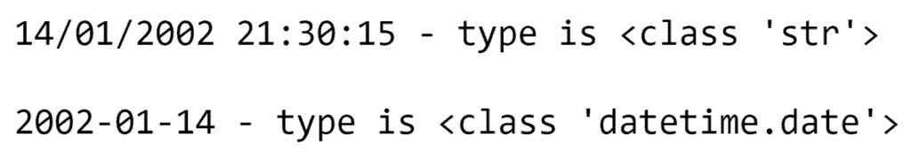

We got a result where only the date is displayed.

### Presenting Date Objects in Different Formats

Using the formatting codes of the datetime module, we can represent date objects in different formats. For example, YYYY/DD/MM, DD-MM-YYYY, or in text form.

Let's look at an example of presenting a date in the form of text:

```python
from datetime import date

# getting today's date
date_today = date.today()

print("Today's date is", date_today)

                                     # method to represent date objects as strings
print("Date in full textual format:", date_today.strftime("%d %B %Y"))

                                                          # short textual format
print("Date in short textual format:", date_today.strftime("%d-%b-%Y"))

print("Date with weekday:", date_today.strftime("%A, %d %B, %Y"))
```

Output:

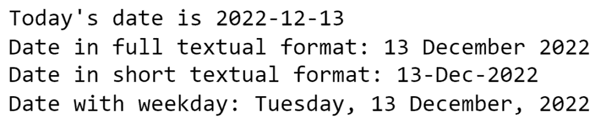

To represent date objects as strings, we used the strftime() method of the datetime module, which has the same formatting codes as strptime(). The strftime() method turns a date object into a string representation, so we end up with a string output.

## String to Time Object

We can also use the datetime.time class to convert a string containing the time to a time object.

As with the date object, we first need to convert the string to a datetime object. Then use the datetime.time() function (constructor) to extract only the time object from the datetime object.

```python
#importing module
from datetime import datetime

# date string in DD/MM/YYYY HH:MM:SS format
date = "14/01/2002 21:30:15"

# checking the type of the date variable
print(date, "- type is", type(date), "\n")

# converting string to time object
date_obj = datetime.strptime(date, "%d/%m/%Y %H:%M:%S").time()

print(date_obj, "- type is", type(date_obj))
```

Output:

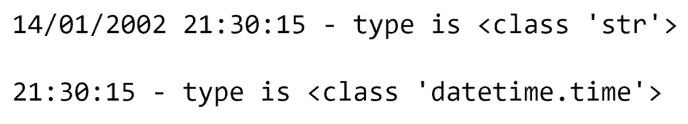

As we can see in this example, we only got 21:30:15 - the time part of the string.

### Presenting Time Objects in Different Formats

Like the date object, we can convert the time object into different formats.

Let's see how to format time objects to represent the time in 12 or 24-hour or AM/PM formats:

```python
from datetime import datetime

# getting current time
time_now = datetime.now().time()
print("Current time -", time_now)

# printing time in 12 and 24 hours format
print("\nTime in 24 hours format -", time_now.strftime("%H:%M:%S"))
print("Time in 12 hours format -", time_now.strftime("%I:%M:%S"))
```

Output:

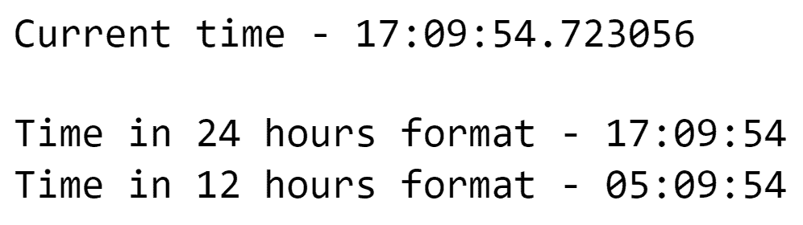

Here we first get the present time using datetime.now() and extract the time element from it. Then we also used the strftime() method on this part, which helped us format the time object and end up with string output.

Let's convert the time object to AM/PM format:

```python
# getting current time
time_now = datetime.now().time()
print('Current time -', time_now)

# %p to represent datetime in AM/PM
print("Time in PM/AM format -", time_now.strftime("%I.%M %p"))
```

Output:


Here we used code to format %p, which gave us the output in a PM format.

## Converting a Pandas Column to Datetime

Pandas has a built-in to\_datetime() function to convert a column to datetime.  
Let's convert this data frame to a datetime object:

```python
import pandas as pd

# pandas dataframe
df = pd.DataFrame.from_dict(
    {'Name': ['John', 'Alex', 'Mia', 'Bena'],
     'Birthday': ['1975-12-13', '2002-01-14', '2005-04-12', '2012-07-27'],
     'Country': ['US', 'UK', 'KG', 'KZ']})

# displaying the dataframe
print(df)
```

Output:


Our Pandas dataframe contains dates in the form of birthdays.  
Let's convert this part into a datetime object.

```python
# converting pandas dateframe to datetime
df['Birthday'] = pd.to_datetime(df['Birthday'])

print(df['Birthday'])
```

Output:

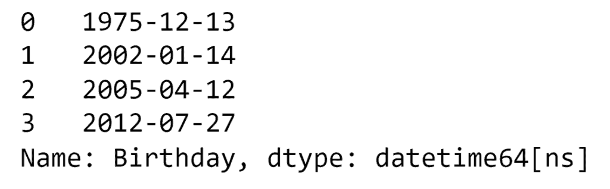

We have just converted birthdays into datetime objects, which means that now it's possible to make various arithmetic calculations on them.

```python
from datetime import timedelta

# using '._get_value' to get access to the dataframes birthday elements
date1 = df._get_value(3,'Birthday')
date2 = df._get_value(1,'Birthday')

# finding the difference between two dates
timedelta = date1 - date2

print("Differance between 'date1' and 'date2' is", timedelta)
```

Output:

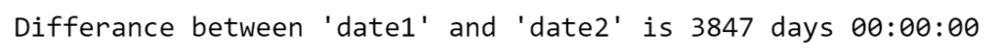

The output above shows the difference between the two dates as days.

## Converting a String to Datetime Using Other Python Libraries

The datetime module in Python can convert all the different types of strings into datetime objects. However, it is time and energy-consuming to create a corresponding line of formatting code each time using strptime().

Other third-party libraries can be used to convert strings to datetime objects. In some cases, these third-party libraries may do a better job manipulating dates and times.

Let's look at some of these libraries for converting strings to datetime objects.

### String to Datetime with Dateutil

The dateutil module is an extension of the datetime module. While using it, we don't need to pass any formatting code to convert a string into a datetime object.

```python
# importing dateutil
from dateutil.parser import parse

# list of string dates with time
dates_list = [
    '2002-01-14 21:30:27.243860',
    'Nov 9 2020 at 9:40AM',
    'September 15, 2007, 23:37:55',
    'Sun, 12/12/1998, 12:30PM',
    '2022-12-13 17:08:00.586525+05:00',
    'Tuesday , 6th September, 2017 at 4:30pm']

# for loop to convert elements of the list using dateutil to datetime
for date in dates_list:
    print("Date is:",date)
    dt = parse(date)
    print("Date object -",dt.date())
    print("Time object -",dt.time())
    print('\n')
```

Output:

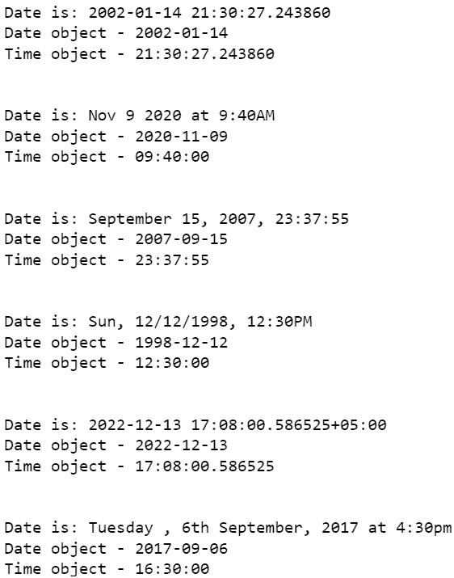

As you can see, the parse function of dateutil library makes converting strings into datetime objects much easier and faster.

### String to Datetime with Maya

Like dateutil, Maya makes it easy to parse the string. However, before we can use this library, we must first download it.  
  
Use 'pip install maya' to install it.

```python
# importing maya
import maya

# string to datetime with specific timezone
date = maya.parse("2022-12-13T20:45:25Z").datetime(to_timezone = "Europe/Berlin")

print("Date is:", date.date())
print("Time is:", date.time())
print("Timezone is:", date.tzinfo)
```

Output:


Maya will automatically convert it to UTC if we don't provide time zone information.

### String to Datetime with Arrow

Arrow is another library for dealing with datetime in Python. It returns a Python datetime object from the arrow object after interpretation.

```python
# importing arrow
import arrow

# converting timezones using the to() method
date = arrow.get("2022-12-13T20:45:25Z").to('America/New_York')

print("Date is:", date.date())
print("Time is:", date.time())
print("Timezone is:", date.tzinfo)
```

Output:

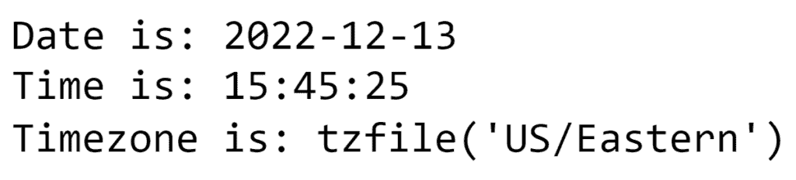

## Converting Datetime Back into Integer, Float, or Strings

We have looked at how to display strings as datetime objects. But we can also convert these datetime objects to integers, float, or strings.

To do this, we will use the strftime() method with functions to convert, such as int() or float().

```python
from datetime import datetime

dt = datetime.now()

x_float = float(dt.strftime("%Y%m%d%H%M%S.%f"))
print("Current date as float:", x_float)
print(type(x_float))

x_int = int(dt.strftime("%Y%m%d%H%M%S"))
print("Current date as intiger:", x_int)
print(type(x_int))

x_str = dt.strftime("%Y%m%d%H%M%S")
print("Current date as intiger:", x_str)
print(type(x_str))
```

Output:

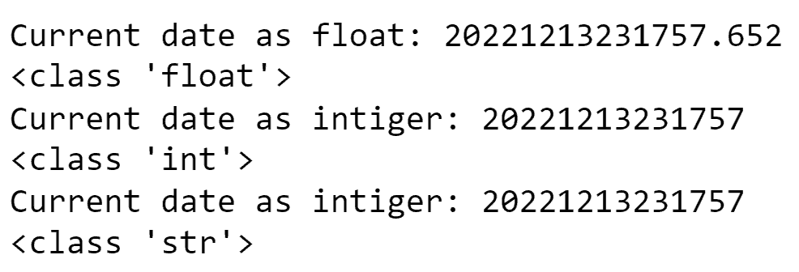

## Conclusion

In this article, we have looked at different ways of converting a string into datetime, date, and time objects in Python. You can use either the default Python datetime library or any third-party libraries mentioned in the article, such as maya, dateutil, or arrow, to do this. Sometimes the third-party libraries add value and make it easier to parse, at the cost of introducing a new dependency.

We looked at the different methods of formatting strings to convert them into a datetime object.  
However, we have found that a significant problem with the default datetime package is that for almost all datetime string formats, we need to specify parsing code manually, which is not an optimal process.

To better understand the material, we suggest you practice all the examples.
