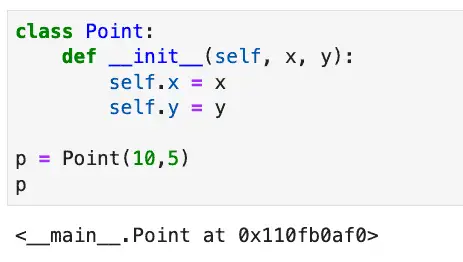

If you've ever created a Python class, you are probably already familiar with dunder methods, though you may not yet know you are. If you don't yet know that you are, you're probably waiting for me to clarify: What is a dunder method?

I'm glad you asked.

A dunder method -- also known as a magic method -- gets its name from the double underscores that begin and end the method name. Dunder methods allow you to build classes that overload Python operators and interact beautifully and seamlessly with Python functions.

## Python Constructors are Dunder Methods

I'm able to make the bold claim that you're familiar with these if you've ever created a class because the most common dunder method of all is a Python constructor. Consider a simple two-dimensional point class.

```python
class Point:
    def __init__(self, x, y):
        self.x = x
        self.y = y
        
p = Point(10,5)
```

Constructors in Python are dunder methods. You can even see the magic happening already. Where did "self" go when we created "p"? It disappeared into the class.

_Abracadabra._

I have a true confession to make about dunder methods. I hinted at it in the title, but now it's time to unburden myself explicitly: I think dunder methods are ugly. My background in object-oriented programming began with C++ and Java, two languages where constructors are just methods with the same name as the class. The `this` pointer (C++ and Javaspeak for "self") was not something you needed to add to your signatures. It just existed, magically. Of course, we were burdened with type declarations and semi-colons and other misfortunes, but at least we had pretty constructors.

However, the more I learned about Python, the more I learned that these "ugly" double underbars are the gateway to the consistency and ease of use that I love so much about Python. For Python magic functions, the ugly is only syntax-deep. The more ugly double-underbars our class has, the more inner beauty they develop.

## Ugly is Beautiful: \_\_repr\_\_ and \_\_str\_\_

Let's take the simple case of examining the contents of a point using the Point class we developed above. Here's how that point above would look if you viewed it in Jupyter Notebook:



Seriously, "`<__main__.Point at 0x110fb0af0>`"? Talk about ugly! Paradoxically, we can beautify the output by adding an somewhat less ugly dunder method. Let's do that now.

```python
class Point:    
    
    def __init__(self, x, y):
        self.x = x
        self.y = y
        
    def __repr__(self):
        return f"Point(x={self.x}, y={self.y})"

p = Point(10,5)
print(p)
```

Output:

```bash
Point(x=10, y=5)
```

When implementing `__repr__`, it's important to have code that can be used to reconstruct the object. As you see here, this code accomplishes both that goal and makes the code human-readable as well.

A related method, `__str__`, can be implemented to provide a slightly different human-readable representation that needn't also be machine-readable. However, I prefer `__repr__` for two reasons. First, now str(p) will default to `__repr__` if str is not defined, so if you're only going to define one, `__repr__` gives you more functionality. Secondly, other Python sequences display their output by calling the `__repr__` method on the contained objects, so we get the following behavior for free by implementing \_\_repr\_\_ on the Point class:

```python
# Lists and dicts using an object that implements __repr__ 

points_list = [Point(i,i*2) for i in range(1,5)]
print(points_list)

points_dict = {str(i): Point(i,i*3) for i in range(1,5)}
print(points_dict)
```

Output:

```bash
[Point(x=1, y=2), Point(x=2, y=4), Point(x=3, y=6), Point(x=4, y=8)]
{'1': Point(x=1, y=3), '2': Point(x=2, y=6), '3': Point(x=3, y=9), '4': Point(x=4, y=12)}
```

Now the output for lists and dicts is not only readable, but it can be passed back in using Python eval or pasted into a source file to reconstruct the original list or dict, because as we discussed before, \_\_repr\_\_ should output a string that can be used to reconstruct the object.

## Operator Overloading and Dunder Methods

Some of our users are happy now that they can print our points and reconstruct lists of them from the output of `print(points_list)`. But there's always that one user -- in our case it's Marty Mathmajor -- who's unimpressed with what we've done and clamors for more. Can we make any kind of an impression on Marty?  
  
Well, we recall that although the sum of two points doesn't make sense mathematically, there are a couple of ways to think about the difference between the two points, let's call them p and q. One approach is to consider it a vector, a direction one would have to travel to get from p and q. Formally, the vector from p to q is given by q−p. But we can't yet subtract q and p yet. Let's see how that method would look (given the above Point class)

```python
    def __sub__(self, other: Point):
        x = self.x - other.x
        y = self.y - other.y
        return Point(x,y)
```

Let's see if we can test it with the simplest case we can think of. Starting from point p at origin (0,0), to get to point q at (1,2), we have to go +1 on the x-axis and +2 on the y-axis, or in other words, (1,2) again. Sure enough, from our definition above it looks like q-p = (1,2) - (0,0) equals (1,2). Let's see if that works given our point class in Python

```python
p = Point(0,0)
q = Point(1,2)
print(q - p)
```

Output:

```bash
Point(x=1, y=2)
```

Now we have the workings of something Marty's sure to be proud of! Normally we'd run to him excitedly to show off our work, but what with the pandemic and all, we're remote now. So we call Marty on Zoom excitedly to screen-share our work.

## Dunder Methods to Integrate Other Python Functions

We show Marty how we can calculate vectors by subtracting points, and he's mildly impressed with us (which is pretty good, if you know Marty). But then he tells us that given a point, p, he wants len(p) to return the distance of the point from the origin. That strikes us as a fairly oddball request, but, well, we're used to Marty by now, so we pour another coffee and give it some thought.

We may not be math majors like Marty -- not since that unfortunate incident with Mrs. Chagnon in 11th grade -- but we remember enough about points to recall we can calculate distances using the Pythagorean theorem. So given origin at p again, the distance of q from the origin is given by the square root of (q.x - 0)2 + (q.y - 0)2. So let's see if we can make this work with the len function.

A quick trip to Google lets us confirm what we suspected, that the len function in python calls the `__len__` method on a class if it's implemented. We happen to recall we can get an even answer of 5 for a hypotenuse if our other two sides are 3 and 4, so in TDD fashion, we jot down our test case:

```python
assert len(Point(3,5)) == 5
```

Now let's have a hand at implementing our `__len__` method:

```python
class Point: 
    
    def __init__(self, x, y):
        self.x = x
        self.y = y
        
    # ...
    
    def __len__(self):
        return math.sqrt((self.x * self.x) + (self.y * self.y))
```

When we run a quick check on our work, we discover a problem. `print(len(Point(3,4)))` gives us an error: "`'float' object cannot be interpreted as an integer`". Of course! Marty was a math major and all, but it slipped by both him and us that len wants an integer result (think the number of items in a list), while sqrt has to return a float. Let's see if we can implement the spirit of Marty's request while giving our users something reasonable:

```python
import math

class Point: 
    
    def __init__(self, x, y):
        self.x = x
        self.y = y
        
    # ...
    
    def magnitude(self):
        """gives a more precise distance from origin"""
        return math.sqrt((self.x * self.x) + (self.y * self.y))
    
    def __len__(self):
        """returns the approximate distance from origin"""
        return round(self.magnitude())

print(len(Point(3,4)))
```

Output:

```python
5
```

There. That's better. Users like Marty who think the length of a Point object is a reasonable request can get a rounded version of the more precise, floating-point distance from the origin, which we're calling magnitude (because it sounds cool, though "distance\_from\_origin" would also work).

Sure, Marty knows his math, but _we're_ speaking the language of science and engineering: Python. (Yes, I really said that).

## Are Dunder Methods in Python a Good Design?

Based on our examples so far, you may be wondering if using dunder methods is a good design.

Dunder methods are an excellent tool that leads to good designs that let your code integrate well with Python operators, loops, and debugging output. However, it's important to make sure that the usage of a dunder method for a given case makes sense given the types involved and clarifies the code rather than obscures it.

There's a good lesson learned from our encounter with our imaginary friend, Marty. Sometimes you certainly _can_ implement some functionality in terms of a dunder method, but it doesn't mean you should. Is having a rounded square-root value useful, and is it obvious that the length of a point is the distance from the origin? All of these are valid design considerations. Honestly, I would answer a firm "no" to those questions for production code, but as a sample of how to implement length, it's a perfectly serviceable example, so I'll leave it at that.

Going back to our Point class again for a moment, we overloaded the subtraction operation to return a directional vector, and this worked out well. For other operators we might overload, the meaning of the operation would be less clear-cut if we overloaded a math operator. Mathematically, adding two points together doesn't really make sense. Multiplying and dividing similarly wouldn't work, though you could certainly do all these things with `__add__`, `__mul__`, and `__div__`. One could perhaps implement multiplying by a number, but in that case, does the number scale the point relative to the origin, or does it create a list of copies?

Some dunder methods that would make sense for points would be `__eq__ a`nd `__ne__`, overloading "`==`" and "`!=`', respectively. Other comparison operators are more problematic. What would "greater than" mean, for example? Further away from the origin? That gets weird. By that reasoning:

`Point(-4,-4) > Point(1,1)`

I'm not sure I'm happy with that.

It also probably doesn't make sense to implement `__hash__` for our Point class as it's currently implemented since hashable objects should generally be immutable as well so the hash value won't change.

As you can see, except for dunder methods that are almost always worth implementing, like `__repr__`, we generally need to consider whether a given dunder method makes sense on a case-by-case basis.

## Implementing Python Iterators Using Dunder Methods

For our next example, let's suppose we work for HyperMegaGiantCarSales.com, and our team has been dealing with lists of lists of car data. A simplified list might look like this:

```python
cars = [["6300", "toyota", "cruiser", "2008", "274117.0", "black"],
    ["2899", "ford", "se", "2011", "190552.0", "silver"],
    ["5350", "dodge", "mpv", "2018", "39590.0", "silver"],
    ["25000", "ford", "door", "2014", "64146.0", "blue"]]
```

Clients everywhere are writing for loops to read the inner list variables, and there's a lot of duplicate code. We know we could each element of the inner list could have been an immutable object, but we never got around to doing it. We could look everywhere we read the inner list variables and do a list comprehension to modify the inner list, but then we'd still have duplicate code, and we really want to consolidate the solution into an easy-to-use class.

One approach would be to create an iterable class that wraps a list of lists. Since we know the format and what the fields represent, we don't need to support those as parameters, we'll just build a simple list-to-named-tuple class that's purpose-built for our code.

Here is the code that accomplishes this, which we'll discuss below:

```python
from typing import List
from collections import namedtuple

class CarList:
    def __init__(self,cars: List):
        """Set up a hard-coded namedtuple class we can use"""
        self.cars = cars
        tuple_name = "Car"
        fields = ["price", "brand", "model", "year", "mileage", "color"]
        self.tuple_class = namedtuple(tuple_name, fields)

    def __iter__(self):
        """Start the iterator on the list of lists"""
        self.list_iterator = iter(self.cars)
        return self
        
    def __next__(self):
        """Convert each element to a named tuple"""
        try:
            row = self.list_iterator.__next__()
            return self.tuple_class(*row)
       # Redunancy explained in text below.
        except StopIteration:
            raise StopIteration
```

In the `__init__` method, on lines 8-9, we've hard-coded the namedtuple class name and the keys for the fields, since we know what the inner list contains in all cases. On line 9, we're creating a namedtuple class that we can use to construct objects.

The `__iter__` method gets called to begin an iteration. For example, this will be called in the first step in a for loop that uses consumes a `CarList` object. We simply set up an iterator on the list variable, and return a reference to our `self` (lines 14-15)

Are we an iterator? Yes, because we implement `__next__` beginning on line 16. Python iterators return either an object (if they still have one), or raise a `StopIteration` exception when they don't have another object to return. On lines 20-21, we simply call \_\_next\_\_ on the lists iterator, then convert that to a named tuple and return it. We catch the StopIteration and re-raise it, which strictly speaking is unnecessary and redundant, but we wanted to show what's happening explicitly for the purposes of the example. When our list is exhausted, we're done.

Now instead of clients having to unpack the variables of the inner list everywhere, they can simply wrap the list in a `CarList` object and loop directly on a series of Car named tuple objects. For example:

```python
cars = [["6300", "toyota", "cruiser", "2008", "274117.0", "black"],
    ["2899", "ford", "se", "2011", "190552.0", "silver"],
    ["5350", "dodge", "mpv", "2018", "39590.0", "silver"],
    ["25000", "ford", "door", "2014", "64146.0", "blue"]]

car_tuples = CarList(cars)
for car in car_tuples:    
    print(f"Found a car with brand = {car.brand} and model = {car.model}")
```

Output:

```bash
Found a car with brand = toyota and model = cruiser
Found a car with brand = ford and model = se
Found a car with brand = dodge and model = mpv
Found a car with brand = ford and model = door
```

## What Are All the Available Dunder Methods?

As a language nerd, one of the features of Python that I love the most is the fact that Python gives so many built-in tools for exploring the language itself. Because of this, for example, you can get the methods on any Python object (including the dunder methods) using the `dir` function. You can then explore those methods using the `help` function, which in turn relies in part on yet another \_\_dunder\_\_ method, the \_\_doc\_\_ method, which represents the docstring for a module, class, or function.

Because Python exposes so many tools for inspection and understanding the language, I thought it would be fun to build a short function that can list the dunder methods and their documentation for any Python object.

Here then is the code listing for explore\_dunder. We'll show some representative output after a brief discussion of the code.

```python
class Color:
    """Make function name stand out"""
    BOLD = '\033[1m'
    END = '\033[0m'

def explore_dunder(any_var):
    """prints the dunder methods (magic methods) of any variable, along with documentation"""
        
    dir_list = dir(any_var)
    dunders = [fn for fn in dir_list if fn.startswith("__") and fn.endswith("__")]
    for fn in dunders:    
        print(Color.BOLD + fn + ":" + Color.END)
        print(f"{any_var.__getattribute__(fn).__doc__}\n")
```

We begin by declaring a Color class with two ANSI escape codes we can use to print our dunder methods in bold. The explore\_dunder function itself begins on line 6. We massage the list of strings returned from the dir method on lines 9-10, with a list comprehension to only return the magic methods and nothing else. Finally, on lines 11-12, we begin printing each dunder method on a line by itself. On the next line, we call \_\_getattribute\_\_ on the name of the original variable, passing it the name of the function. This returns the dunder method itself, and by referencing the attribute \_\_doc\_\_, we're able to print out the documentation string for the dunder method.

We note in passing that \_\_doc\_\_ is not a method, so not everything in Python with double underbars is necessarily a function you can call. Other examples in this category are things like \_\_init\_\_.py, a filename for marking packages, and \_\_name\_\_, which gives a module's name or "\_\_main\_\_" if the module is being executed.

You'll find that calling explore\_dunder on an object will give you a wealth of information about the dunder methods that are available and some basic documentation about each method. This output will be both fairly lengthy and fairly high-level, to get further documentation about specific methods, you can paste the name into the [Python 3 Documentation](https://docs.python.org/3/).

To give you an idea of the type of information that's available here's the complete output of the function on a simple string:

```
msg = "Hello"
explore_dunder(msg)
```

Output:

```bash
__add__:
Return self+value.

__class__:
str(object='') -> str
str(bytes_or_buffer[, encoding[, errors]]) -> str

Create a new string object from the given object. If encoding or
errors is specified, then the object must expose a data buffer
that will be decoded using the given encoding and error handler.
Otherwise, returns the result of object.__str__() (if defined)
or repr(object).
encoding defaults to sys.getdefaultencoding().
errors defaults to 'strict'.

__contains__:
Return key in self.

__delattr__:
Implement delattr(self, name).

__dir__:
Default dir() implementation.

__doc__:
str(object='') -> str
str(bytes_or_buffer[, encoding[, errors]]) -> str

Create a new string object from the given object. If encoding or
errors is specified, then the object must expose a data buffer
that will be decoded using the given encoding and error handler.
Otherwise, returns the result of object.__str__() (if defined)
or repr(object).
encoding defaults to sys.getdefaultencoding().
errors defaults to 'strict'.

__eq__:
Return self==value.

__format__:
Return a formatted version of the string as described by format_spec.

__ge__:
Return self>=value.

__getattribute__:
Return getattr(self, name).

__getitem__:
Return self[key].

__getnewargs__:
None

__gt__:
Return self>value.

__hash__:
Return hash(self).

__init__:
Initialize self.  See help(type(self)) for accurate signature.

__init_subclass__:
This method is called when a class is subclassed.

The default implementation does nothing. It may be
overridden to extend subclasses.


__iter__:
Implement iter(self).

__le__:
Return self<=value.

__len__:
Return len(self).

__lt__:
Return self<value.

__mod__:
Return self%value.

__mul__:
Return self*value.

__ne__:
Return self!=value.

__new__:
Create and return a new object.  See help(type) for accurate signature.

__reduce__:
Helper for pickle.

__reduce_ex__:
Helper for pickle.

__repr__:
Return repr(self).

__rmod__:
Return value%self.

__rmul__:
Return value*self.

__setattr__:
Implement setattr(self, name, value).

__sizeof__:
Return the size of the string in memory, in bytes.

__str__:
Return str(self).

__subclasshook__:
Abstract classes can override this to customize issubclass().

This is invoked early on by abc.ABCMeta.__subclasscheck__().
It should return True, False or NotImplemented.  If it returns
NotImplemented, the normal algorithm is used.  Otherwise, it
overrides the normal algorithm (and the outcome is cached).
```

## You May Also Enjoy

[Python Format Strings: Beginner to Expert](https://codesolid.com/python-format-strings/)

[Python Dataclass: Easily Automate Class Best Practices](https://codesolid.com/python-dataclasses/)
