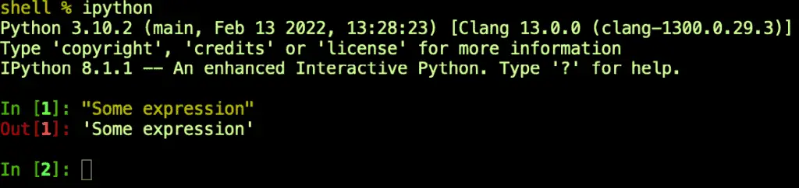
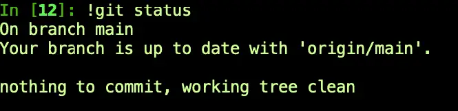
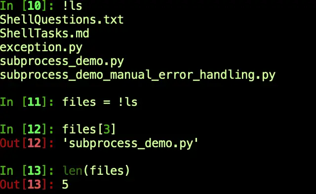

If you ask developers about Python, those who love it may tell you that it's a powerful, object-oriented, multi-purpose language. They'll also say it supports many use cases, including back support for back-end web development, data science, cloud programming, and more. On the other hand, those who hate it may tell you it's "just a scripting language."

Like Bash, Python enables you to work quickly and to run scripts without a separate (manual) compile step. Additionally, Python lets you choose between running a file with your program's statements or working interactively at the command line. So there is a lot of overlap between the two. It's revealing that even Python's detractors acknowledge that it has excellent support for tasks one can otherwise use Bash or another Linux / Unix shell to accomplish.

However, for all the surface similarities, Bash and Python differ in many important ways. We want to spend some time comparing them, but our goal is broader. What we want to understand are topics like these:

- How can we accomplish some of the things in Python that we can also do in Bash?
- Is Python good for shell scripting, or must I use Bash, the "native" shell language?
- What Python runtime libraries do we need for shell programming?
- How can I run external programs from Python?
- What Python Shells have good support for working with the system shell?

With that brief introduction out of the way, let's dive right in!

## Is Python Good for Shell Scripting?

Strictly speaking, Python is not a shell programming language, so it does not create shell scripts in the same sense as Bash scripts, batch files, or PowerShell scripts. However, Python does allow you to easily create simple and readable scripts that will work across different platforms.

### The Strengths of Shell Scripts

To better understand this, let's first discuss what a shell is, which will help us understand what shell scripts are and where they excel. A shell is simply a tool that provides an abstract or high-level interface to an operating system. This interface can be anything, really, but generally, what we mean by a system shell is a command-line program. So we don't usually use "shell" to refer to a graphical user interface. However, that command line "shell" can run inside a graphical user interface as a "terminal window."

This definition is not exact because Bash has been ported to Windows, and you can even run PowerShell from a Mac or Linux machine. But generally speaking, shell scripts work best as glue for other operating system utilities. For example, Bash is easy enough to run on Windows. Still, unless you do it in the Windows Subsystem for Linux, you may need several other Linux utilities to "port" a Bash script successfully.

System Administrators are often great fans and experts in shell scripting. A tool that can "script" tasks they'd otherwise type by hand is a substantial win for this community. However, this same reliance on operating system utilities makes shell scripts somewhat less portable than Python.

### Python as a Shell Scripting Tool

In contrast to operating system shell scripting languages, Python has several advantages.

From the perspective of a beginner wondering where to invest their time, Python has a clear advantage in being a more general-purpose tool. It's hard to imagine using Bash to handle web requests or data science tasks, but both these use cases are well-supported in Python.

Python is also more portable than shell scripting tools. As we mentioned earlier, most of the valuable work you do in Bash consists of wiring up and integrating other programs. In Python, in contrast, the standard runtime library provides many tools for a variety of tasks that don't rely on other dependencies being available. Though there are portions of the standard library that are non-portable, such as pipes (Unix only) and `winreg` (for working with the Windows registry), the great majority of Python libraries work equally well without further dependencies on Windows, Mac, or Linux. Of course, as with any language that supports a portable runtime such as Java, the tradeoff is that Python must be available on the target machine.

## How can I Run Shell Commands from Python?

This section has two main goals.

The first goal is to introduce several packages and places to look for general shell programming tasks. Because Python's runtime libraries provide so many built-in utilities that do the sorts of things you can also do in shell scripts by launching a program, you may not need to execute a separate process as routinely as you would in Bash.

The second goal is to discuss how to use the subprocess module. Even though you won't need to use separate processes as often as you do in Bash, you'll still find you need to do this from time to time. We'll walk through some ways you can use the subprocess module's run function and the more flexible Popen constructor to call shell commands or other external applications.

### The Top Nineteen Modules for Python Shell Programming

This section is for you if you're new to Python and wondering where the shell script toolset is to let you accomplish what you could in Bash or another tool. Python support for shell scripts falls into two main categories:

- Built-in functions (i.e., functions you can call without an import).
- Python standard library functions. These functions and modules are available using "import" but are part of Python. Therefore, you don't need to install them using Pip, Conda, or a similar tool.

To very briefly discuss built-in functions, two that you will find yourself using all the time are `print` and `open`. From a Bash perspective, that's what you need to make a beginning on the equivalent of "echo" and "cat." You can use the `input` function to prompt the user for a value, but shell scripts commonly rely on command line arguments. Of course, you can also use any other Python language features tools as well, so although most scripts are procedural, if it makes sense to develop a simple class for your program, for example, you can do so.

Beyond the built-in functions, for the cost of an import statement, you also have access to the rich Python standard library, and we turn to that now. For each of the Python modules below, I discuss the features that I believe are most relevant for writing shell scripts. You should consult the Python documentation for the many other functions these modules contain if you need to go further. Unless otherwise indicated, the quoted material in this list comes from the relevant section of that same [Python documentation](https://docs.python.org/3).

- `**os**`: Python's os module _"provides a portable way of using operating system dependent functionality"_. This module contains a number of useful tools for working with environment variables. `os.environ` is a mapping object (similar to a dictionary) that allows you to both read and write environment variables, or you can use the `getenv` and `putenv`. It contains tools for querying or changing the current working directory, `os.getcwd` and `os.chdir`, respectively. This module also includes several functions for working with the current process id and other functions related to users and groups. Many of the group functions are available only on Linux / Mac.
- **sys**: Perhaps the most commonly used gem in this module is `sys.argv`, a list that contains the name of the current script file as the first element, and any command-line arguments passed to the script, in order, as the remaining elements of the list. (The filename returned here is just the file itself; use the \_\_file\_\_ built-in if you need the whole path). Other important features of this module include:
    - `sys.platform` for querying what operating system we're running on, e.g. "darwin" for macOS, "linux", or "win32". (The last value is also what you get on 64-bit Windows, by the way).
    - `sys.version` allows you to discover the current Python version number as a string, while `sys.version_info` gives you a tuple you can use to get the various version numbers: major, minor, etc.
    - `sys.path` is useful for querying the Python module search path for troubleshooting purposes. It can also be used to modify the search path, for example, to locate Python dependencies in a "dependencies" folder rather than directly underneath the program.
- **argparse:** The `argparse` module lets you go beyond the simple command line argument reading provided by `sys.argv` not only to parse more sophisticated command line options but also to provide help and instructions to the user of the script about the available options.
- **getopt:** Another command line parser is getopt. Although argparse is generally the preferred option, this package is an alternative for developers who may be familiar with the equivalent UNIX `getopt` C function.
- **platform:** Just as argparse goes beyond what you can do with `sys.argv`, the `platform` module provides a wealth of information about the operating system, machine architecture, and Python version on which you're running. Once you have basic information about the operating system, you can also drill down to get more information using platform-specific functions such as `platform.win32_edition` or `platform.mac_ver`.
- **tempfile**: This module allows you to create temporary files and directories in a platform-independent way. It contains functions for creating temporary files that require manual cleanup, as well as several classes that can be used as context managers, automatically cleaning up when you're finished with them.
- **pathlib**: When writing useful shell scripts, needing to lookup paths comes up a lot. Often we need to look up a path relative to the current Python \_\_file\_\_, for example, or build a path based on the user's home directory. Pathlib contains a lot of what you need to do this and other path-related tasks. For a detailed tutorial that walks you through many such use cases, see our article, [Find Files in Python: Complete Cookbook for Searching Files and Folders](https://codesolid.com/python-files-from-beginner-to-expert/).
- **shutil**: The shutil module provides support for many file and directory operations such as copying files to different directories, (including recursively using `copytree`), moving them or deleting files and directories.
- **glob**: The glob module supports finding files and directories using path globs (I.e., wildcards such as \*), to match whole sets of files.
- **filecmp**: Filecmp allows you to compare files and directories to provide summary information about which files match and which have changed. To compare the contents of individual files (or any sequences) in detail, the **difflib** module can be used instead.
- **zlib, gzip, bz2, lzma, zipfile, tarfile**: In addition to the many general file handling libraries we've already discussed, shell scripts often need to be able to work with compressed archive files. Launching a sub-process to zip or tar a file can be problematic, because it relies on utilities that may not be available, especially on Windows. Instead, your Python shell script can rely on these libraries to add or extract files from an archive.
- **pipes:** Much like the Unix shell's pipe operator, "|", the `pipes` module lets you use the output from one process as input to another. This module is deprecated as of Python 3.11 in favor of using the `subprocess` module.
- **subprocess:** The `subprocess` module lets you call another program, wait until the call is complete, and process the results including any output or errors. This is perhaps the most common task of all that shell scripts are called upon to do, so we're going to discuss it in much more detail in the next section.

### The Subprocess Module: Run External Programs In Python

Because shell scripts are so often called upon to run other programs, the `subprocess` module is a crucial tool for writing a shell script in Python. This is even still true in Python, though as we discussed in the last section, many standard library tools make it slightly less necessary to glue other programs together than in Bash.

### Python's Subprocess Module: Basic Example

The `subprocess` module's documentation recommends using `subprocess.run` for most uses. This is a simplified method that uses the more flexible `subprocess.Popen` class, which can be used if you have more advanced use cases.

Let's take a look at a simple program that uses the `subprocess` module and another module. In order to demonstrate how you might adapt your shell script for different environments, we detect the platform using the `platform` module we discussed earlier. One caveat about this example is that intentionally making this program accessible also is a double-edged sword because as written, you could much more easily accomplish the results of this program in Python without the `subprocess` module. However, I wanted the example program to be easy to run so you wouldn't have more to set up before trying it out.

**subprocess\_demo.py**:

```python
"""
Shows a basic use of the subprocess module.
"""

import subprocess
from platform import system

def file_lister():
    """Gets a platform-appropriate file lister"""
    if system() == "Windows":
         return "type"
    else:
        return "cat"

def call_subprocess():
    """Get the contents of the current file using a subprocess."""
    args = f"{file_lister()} {__file__}"
    results = subprocess.run(args, capture_output=True, 
        text=True, check=True, shell=True)
    display_summary(results.stdout, 3)

def display_summary(output, lines):
    """Prints only the first few lines of the file"""
    print(f"Here are the first {lines} lines of the file:\n")
    lines = output.split("\n")[:lines]
    print("\n".join(lines))
    
if __name__ == "__main__":
    """Call a subprocess to get the contents of this file"""
    call_subprocess()
```

The output will be the first few lines of the above file. In the example above, we're calling `suprocess.run` in the `call_subprocess` function. We have chosen a few arguments of the many available to pass to the function, so let's briefly discuss the ones we've selected:

- **args**: Here we're passing the first positional argument, "args" as a string, which will resolve to `"type subprocess_demo.py"` on Windows or "`cat subprocess_demo.py`" on Mac/Linux. When passing a string containing the complete shell command like this instead of an array containing each argument, we also need to pass the argument shell=True, which we'll discuss further below.
- **capture\_output=True**: This is the most direct way to get the output of the program available to us. If you don't pass either this argument or otherwise specify how you want STDOUT and STDERR handled, any text output from the function will be unavailable.
- **text=True**: Probably to avoid breaking Python 2 code, the default type in Python 3 for the stdout and stderr attributes that are returned on the results object is a bytes array. Adding `text=True` here is the most straightforward way to get a nice happy UTF-8 Python string.
- **check=True**: This is a convenient way to get the sort of basic error handling we might want in a shell script. With this argument in place, if `result.returncode` is non-zero (i.e., if we received an error from the shell command), the run function will throw an exception. Though the output won't be all that pretty, it will give us an idea of where our script is failing so we can troubleshoot further. We'll discuss ways to improve on that in the error handling section below.
- **shell=True**: Depending on what you need, the `subprocess.run` function can be called in a couple of different ways. In our case, we know that "`type`" is a built-in shell function on Windows, whereas "`cat`" on Mac is an actual executable program sitting somewhere. ("`where cat`" on my machine gives "`/bin/cat`", and now the cat is out of the bag). Feline humor aside, the point is that for Windows built-in functions, we _must_ call `subprocess.run` with a string argument instead of a list, and pass `shell=True`. The downside of this approach is that you don't want to use it for untrusted code, in that case, you likely want shell=False (the default), and an array of argument tokens in for the first, default argument.

### Subprocess Run: Return Values and Error Handling

The `supbrocess.run` function returns a CompletedProcess object, with only a few attributes. The `args` attribute contains the same arguments we passed to the run method. The `returncode` will be zero on success, or non-zero if the process fails. You can't count on all programs doing this, but in general, if the `returncode` is zero and you captured the output, then `stdout` will contain the output, and `stderr` will be an empty string. The reverse will be true for a non-zero exit code.

In terms of error handling, as we mentioned earlier, passing check=True will return an exception. We can test this by changing the args line to this:

```python
args = f"{file_lister()} NO_SUCH_FILE"
```

With this change, the program output will look something like the following stack trace:

```bash
Traceback (most recent call last):
  File "/Users/johnlockwood/source/CodeSolid/private_work/articles/shell/exception.py", line 32, in <module>
    call_subprocess()
  File "/Users/johnlockwood/source/CodeSolid/private_work/articles/shell/exception.py", line 20, in call_subprocess
    results = subprocess.run(args, capture_output=True, 
  File "/Users/johnlockwood/.pyenv/versions/3.10.2/lib/python3.10/subprocess.py", line 524, in run
    raise CalledProcessError(retcode, process.args,
subprocess.CalledProcessError: Command 'cat NO_SUCH_FILE' returned non-zero exit status 1.
```

In the following listing, we've modified the imports and the call\_subprocess method to add a general-purpose error handler you can use for subprocess calls. We also added that handler function as `handle_exception`. The only required argument for that method is the handler itself, the other arguments are available to display the stack trace in various levels of detail if that will help in your troubleshooting.

```python
"""
Subprocess demo with a general purpose exception handler added.
"""

from subprocess import run, CalledProcessError
from platform import system
from traceback import print_exception, format_exc
from sys import exit


def file_lister():
    """Gets a platform-appropriate file lister"""
    if system() == "Windows":
        return "type"
    else:
        return "cat"


def handle_exception(error: CalledProcessError, print_last=False, 
    stack_trace: bool = False):
    """Handle a subprocess.run error CalledProcessError:

    Arguments:
    error       - The CalledProcessError exception.  Required.
    print_call  - Also display the line throwing the exception.  Optional, default = False.
    stack_trace - Print a full stack trace.  Optional, default = False.

    """
    print(f"Command:     {error.cmd}")
    print(f"Return code: {error.returncode}")
    print(f"STDERR:      {error.stderr}")
    if stack_trace:
        print_exception(error)
    elif print_last:
        print(format_exc().splitlines()[1])
    exit(1)


def call_subprocess():
    """Demonstrate a subprocess.run exception handler"""
    args = f"{file_lister()} NO_SUCH_FILE"
    try:
        results = run(args, capture_output=True, text=True, check=True, shell=True)
        display_summary(results.stdout, 3)
    except CalledProcessError as error:
        handle_exception(error)


def display_summary(output, lines):
    """Prints only the first few lines of the file"""
    print(f"Here are the first {lines} lines of the file:\n")
    lines = output.split("\n")[:lines]
    print("\n".join(lines))


if __name__ == "__main__":
    """Call a subprocess to get the contents of this file"""
    call_subprocess()
```

As you can see, handling an error is as simple as adding a try/except block and calling the function.

## Python Command-Line Tools That Work with Bash

If you are familiar with Bash or other shell scripting tools, you likely have noticed that our Python "shell scripts" have become a bit more verbose than you may be used to. This is especially true when it comes to launching subprocesses.

In addition, you may want a tool where you have all the language features and libraries of Python without giving up the convenience of being able to list and manipulate files and directories easily as you can in Bash. Two tools that let you have your cake and eat it, too, are IPython and Xonsh.

I mention Xonsh for completeness here -- it is an ambitious project that features a new Bash-like language overlaid on a Python shell. Xonsh certainly has attracted a few fans who use it routinely, but after trying it out for some time, I found it to be a bit quirky and hard to learn, and if I'm going to work on something like that, I prefer mathematics!

IPython is a different story. IPython is a robust and popular Python shell, and it's one of the few packages that I usually install globally rather than in a virtual environment -- because it's too useful not to have it. If you're new to IPython, because it's a Python shell, you can begin using it as a drop-in replacement for the default Python shell. The only surprise you'll encounter early on is a cell-based interface reminiscent of Jupyter Notebook (which is not surprising, inasmuch as "Jupyter" notebooks were once "IPython" notebooks). Beyond that, you can enter any Python expression and see it evaluated just as you can in the "vanilla" Python shell.



IPython has many more great features than we can consider in this article, but two that are relevant to our discussion are _magic commands_ and something the IPython docs call the "_!cmd syntax_."

IPython magic commands behave much like bash aliases. They're named commands that run some other command or group of commands. You don't always need to create these aliases yourself; IPython includes many of the most popular shell commands as magic commands. You can list these using the alias command with no arguments:


(Note: If that command didn't work as shown, try calling this first "`%automagic ON`". Running that command sets a configuration so you don't have to type a % sign before a magic command).

Because these shell commands are aliased as IPython magic commands, you can simply type them in IPython as you would at a system shell. For example "`ls .`" will show you the files in the current directory.

What if the shell command you want to run isn't included in the list? No problem, simply prefix the shell command with an exclamation point, and it will work just fine. Let's see how our Git repository is doing:



The exclamation point operator has another useful feature that you can use with commands whether or not they have any alias associated with them. Calling a command with the exclamation point prefix returns the resulting output as a list of lines. (Well, technically it returns an object of type `IPython.utils.text.SList`, but that object behaves very much like a list).

When we used it on git just now, we simply displayed those lines to the screen -- but we can also save them to a variable. Here we grab the contents of a directory we're working on to a list:



As you can see, IPython functions very well not just as a Python shell, but also as a general-purpose terminal.

As powerful and flexible as IPython is as a shell replacement, you do need to give some thought before using it as a general scripting tool. First, the issue that Python has in this regard of not being available on every computer is further exacerbated by IPython, which requires a separate package install over and above what Python needs. Secondly, certain shell utilities like the `!cmd` syntax we've been discussing may only work in the interactive shell and might not be available to you as a script.
