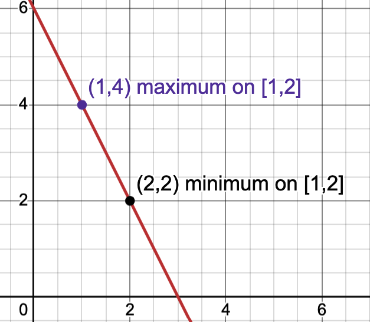

---
jupytext:
  formats: md:myst
  text_representation:
    extension: .md
    format_name: myst
    format_version: 0.13
    jupytext_version: 1.16.1
kernelspec:
  display_name: Python 3 (ipykernel)
  language: python
  name: python3
---

We have the following problem to solve:

-----


+++

Here's how the graph of the function looks over this interval:



+++

The function is descending.

```{code-cell} ipython3
f = 6 - 2*x
```

```{code-cell} ipython3
integrate(f, (x,1,2))
```

```{code-cell} ipython3
def fn(x):
    return 6 - 2*x
```

```{code-cell} ipython3
def fn2(z):
    return 4*z + 5

#fn2a = sympify(str(fn2))
summation(4*x + 5, (x, 1, 3))
```

```{code-cell} ipython3
summation(6 - 2*x, (x, 1, 5))
```

```{code-cell} ipython3
f
```

```{code-cell} ipython3
integrate(f)
```

```{code-cell} ipython3
integrate(f, (x, 10, 200))
```

```{code-cell} ipython3
f = -1/2 * (1/x**4)
```

```{code-cell} ipython3
diff(f)
```

```{code-cell} ipython3
f = 1/(-3*x**6)
```

```{code-cell} ipython3
diff(f)
```

```{code-cell} ipython3

```
