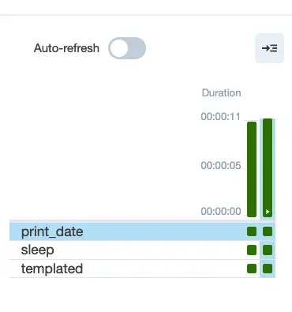
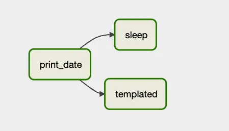
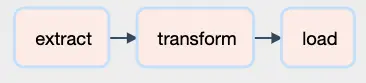
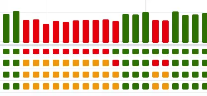
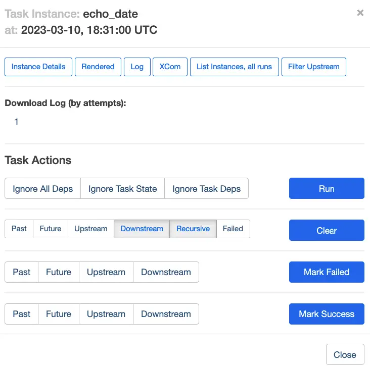

Table of Contents

- [Introduction](#htoc-introduction)
- [System Requirements and Installing Airflow](#htoc-system-requirements-and-installing-airflow)
- [The Airflow Web Interface](#htoc-the-airflow-web-interface)
- [Understanding How DAG Tasks Are Related](#htoc-understanding-how-dags-are-created)
- [Apache Airflow 2.0 and the TaskFlow API](#htoc-apache-airflow-2-0-and-the-taskflow-api)
- [Mixing Apache Airflow 2.0 Style Tasks with Legacy Tasks - An Example](#htoc-mixing-apache-airflow-2-0-style-tasks-with-legacy-tasks)
    - [Discussion](#htoc-d)
- [Scheduling, The Dags Directory, and Configuration](#htoc-scheduling-the-job-working-with-the-dags-directory-and-airflow-configuratio)
- [Revisiting Airflow Logging](#htoc-revisiting-airflow-logging)
- [Closing Thoughts](#htoc-closing-thoughts)

## Introduction

Apache's Airflow project is a popular tool for scheduling Python jobs and pipelines, which can be used for "ETL jobs" (I.e., to Extract, Transform, and Load data), building machine learning models, updating data warehouses, or other scheduled tasks.

Airflow is an excellent choice for Python developers. Unlike other solutions in this space, such as AWS step functions, in Airflow, you define the entire pipeline in Python, not just the code for the steps. Conveniently, however, you can also integrate bash scripts easily through Airflow's bash "operator" (plugin).

Though an open-source project, Apache Airflow has wide industry support. Two major cloud providers, AWS and Google, have managed products built on Airflow (Amazon Managed Workflows for Apache Airflow, or MWAA) and Google Cloud Composer, respectively. Although there is no comparable solution on Azure, there is a [quickstart template](https://github.com/savjani-zz/azure-quickstart-templates/tree/master/101-webapp-linux-airflow-postgresql "quick-start template") for deploying Docker-based Airflow and PostgreSQL.

Getting started with Apache Airflow development on your local machine is generally straightforward. Still, you may encounter many questions about the behavior of Airflow along the way.

In this article, I walk you through the steps involved and answer some of the questions I had when I first tried this exercise myself. I hope by working through this in a slightly different order than I did, I can help you address some of the issues I had when I went along.

## System Requirements and Installing Airflow

Airflow is straightforward to install and run on Linux or Mac. For Windows, it needs to be run on [WSL2 or in Linux containers](https://pypi.org/project/apache-airflow/ "WSL2 or in Linux containers"). Airflow's default database for testing is SQLite 3.15.0+, so you may need to have that binary installed before beginning. As of the time of this writing, Airflow supports Python 3.7 through 3.10. I used Miniconda to set up an environment with Python 3.10, but you can also use PyEnv to manage Python versions. (See [Conda vs. PyEnv](https://codesolid.com/conda-vs-pip/#htoc-conda-vs-pyenv) for some of the tradeoffs). Here's the conda version:

```bash
# Using Conda to create an isolated environment for airflowb
conda create -n airflow python=3.10  
conda activate airflow
```

Once this is done, airflow is installed using pip:

```bash
pip install apache-airflow
```

From this point, you can explore the Apache Airflow quickstart and tutorials on the main documentation page. I especially recommend spending additional time on the quickstart, which I glossed over somewhat in my rush to get my hands dirty with code. With Airflow installed as above, an important shortcut you can run is the following:

```bash
airflow standalone
```

## The Airflow Web Interface

This initializes the database, creates a user, and starts both the web server and the scheduler. If we navigate to the web browser run by the command above (It should be at [http://localhost:8080/](http://localhost:8080/)), we land by default on the DAGs view, a portion of which is shown here:


A DAG is a Directed Acyclic Graph, in other words, a graph in which nodes don't lead to paths that loop back to other nodes (though they can branch, and individual nodes can, of course, contain loops in their Python code). So you can think of the DAG as your workflow or pipeline, and the nodes of it are the steps.

In the view above, we see two active tasks which you likely won't have when your first start. The tutorials ship in a paused state, but you try one by navigating to the paused tab, then scrolling down to the DAG named "Tutorial," for example. If you look to the right, you'll see a start button that looks promising, and clicking on it shows this popup:


Since we don't need to modify the config, we can click on Trigger DAG. This should start the DAG, and you should now see it appear on the active tab. If we click on the DAG name itself, we get a wealth of information available through this navbar:


The Grid view shows us the results of each run, which should be green (successful) at this point:



The boxes below represent the status of each step.

Under the "Graph" tab, we can see a graphical representation of the steps (nodes) of the DAG and how they relate to one another:



As you can see, after print\_date, the steps labeled sleep and templated are called.

## Understanding How DAG Tasks Are Related

To see how that's accomplished in code, click on the Code tab of the navbar. Here we see three tasks defined with the somewhat cryptic names, t1, t2, and t3 (print\_date, sleep, and templated, respectfully). For example, t1 looks like this:

```python
 t1 = BashOperator(
        task_id="print_date",
        bash_command="date",
    )
```

(As an aside, by way of code review, I'd recommend making the variable names consistent with the task\_id names since this would make the code more clear).

We define the task in this case by instantiating an operator, a BashOperator. We give it an ID and something to do in bash: print the date. (Note that the task\_id is also the name as it appears in the Graph view).

With three such operators defined, we must scroll down to see how they're wired together. What we find is both pretty concise and pretty strange:

```python
t1 >> [t2, t3]
```

Well, If we'd named our variables after their task IDs, the code above would look like this:

```python
print_date >> [sleep, templated]
```

This should remind you of the graphical representation of the DAG above. It may look like magic, but what's happening is that Airflow overloads the bit shift operators for certain objects (using the \_\_lshift\_\_ and \_\_rshift\_\_ special methods). For example, the right\_shift operator called here calls set\_downstream on the operator or the list of operators given in the list, so clarified still further, this is equivalent to:

```python
print_date.set_downstream([sleep, templated])
```

Don't worry; those leftshift and rightshift operators eventually grow on you. In case they haven't yet, Googling "Operator overloading cautions" will provide you with this consolation that you're not alone:


## Apache Airflow 2.0 and the TaskFlow API

Going again through the tutorials, we learn that as of Apache 2.0, there's a new API that makes writing and wiring up tasks easier and more like writing "regular" Python code. One of the things that TaskFlow made easier and was designed to address was the issue of how to pass data from one step to another. The tutorial for this API has a great example of how to do this and how much easier it is to accomplish this using TaskFlow than the pre-2.0 solution.

Glossing over the details somewhat, rather than creating a key-value pair at the end of a task and retrieving it in a subsequent task, with TaskFlow, you can simply return data and then pass it to the next function.

This also changes how tasks are wired up. Looking at the Graph for this tutorial, we get the following simple flow process:



Looking at how those tasks are wired up, we see the following code:

```python
    # [START main_flow]
    order_data = extract()
    order_summary = transform(order_data)
    load(order_summary["total_order_value"])
    # [END main_flow]
```

Aside from making it easier to return data, one nice thing that falls out of the API is that the tasks now match the function name. The naming mismatch ("t1" for "print\_date") that we quibbled with earlier now goes away. You can see this in the functions' names in the last snippet.

That's because the tasks are now set up as plain Python functions with an `@task()` annotation added. For example, here's the code for the `extract` task.

```python
    @task()
    def extract():
        """
        #### Extract task
        A simple Extract task to get data ready for the rest of the data
        pipeline. In this case, getting data is simulated by reading from a
        hardcoded JSON string.
        """
        data_string = '{"1001": 301.27, "1002": 433.21, "1003": 502.22}'

        order_data_dict = json.loads(data_string)
        return order_data_dict
```

One caveat about this tutorial is that even though it seems like we're now dealing with more simple return values, under the hood, this still uses the same key-value pair mechanism from the pre-2.0 days, which were called XComs (for Cross-Communication). This mechanism was designed for passing small amounts of data only, so a more realistic ETL example would perhaps save the extract values to a temporary table, Parquet file, or the like and return a string representing the table or filename.

A few questions occurred to me when I first encountered these tutorials and began working with them.

First, as a proof of concept, I wanted to see some scheduled tasks run. So far, I had been invoking them from the command line. Two handy CLI commands are worth mentioning at this point.

- To run a workflow (DAG): `airflow dags test <dag_name>`

- To run a single task in a DAG: `airflow tasks test <dag_name> <task_name>`

Before I revisited the Airflow web interface using `airflow standalone` as described above, I was running the scheduler using `airflow scheduler`. To see a task get picked up, I needed to set the scheduled interval more aggressively -- unrealistically so if running in production. To do this, I specified the DAG options as follows:

```python
@dag(
    # Note:  "schedule_interval" is deprecated
    schedule="* * * * *",
    start_date=pendulum.datetime(2023, 1, 1, tz="UTC"),
    catchup=False,
    tags=["example", "CodeSolid"],
)
```

This leverages the fact that one way to specify a schedule in Airflow is with a CRON specification; using five asterisks here amounts to saying, "run this every minute."

Getting a job to run in the scheduler led me to my second question. I noticed that the scheduler output was relatively sparse and did not include the output of any Python print statements or echo statements in bash. Because of this, I decided to add a custom logger to my example. It turns out a much simpler approach is to use the Web interface. We'll look at this later on.

Finally, one thing that interested me was how compatible the new TaskFlow API was with the earlier way of instantiating operators and wiring them up using overloaded shift operators. Although this might not be important for new code, it did seem like an essential concern if one was dealing with legacy code and migrating it forward.

## Mixing Apache Airflow 2.0 Style Tasks with Legacy Tasks - An Example

So with these motivating questions in mind, here is the code for Yet Another Apache Airflow Tutorial, `scheduled.py`:

```python
# scheduled.py

import pendulum
from airflow.decorators import dag, task
from airflow.operators.bash import BashOperator
import pathlib

def get_log_info():
    """returns the log directory and logfile name"""    
    airflow_home = pathlib.Path.home().joinpath('airflow')
    log_dir = airflow_home.joinpath("task_logs")
    log_file = log_dir.joinpath("scheduled_task.log")
    return log_dir, log_file

@dag(
    # Note:  "schedule_interval" is deprecated
    schedule="* * * * *",
    start_date=pendulum.datetime(2023, 1, 1, tz="UTC"),
    catchup=False,
    tags=["example", "CodeSolid"],
)
def scheduled_task():
    """
    ### Record the date every minute. 
    An example task combining @task decorators with tasks 
    defined as operators
    """
    @task()
    def setup():
        """
        #### Setup task
        Creates a task_logs directory if it doesn't exist.  
        Note that manual logging this way turned out to be 
        overkill and the wrong way to do task logging, 
        as the Apache logs will capture this for simple 
        "print" or echo commands. 
        
        However, we illustrate some other concepts in 
        this example, so we're leaving it in.

        See the discussion here:
        https://codesolid.com/airflow-python-etl/
       """
        log_dir, _ = get_log_info()
        if not pathlib.Path.exists(log_dir):
            pathlib.Path.mkdir(log_dir)

    @task 
    def prove_python_task():
        """Making sure I can log from Python as well as bash.
        Another TaskFlow style task
        """
        _, log_file = get_log_info()   
        with open(log_file, "a") as f:
            f.write("The Python task worked OK\n")

    """Echoing the date using a pre-TaskFlow style operator"""
    echo_date = BashOperator(
        task_id="echo_date",
        bash_command='echo "Printing the date to the console $(date)"',
    )
    """Log the date to the custom log, also in pre-2.0 style"""
    log_date = BashOperator(
        task_id="log_date",
        bash_command='echo "Logging the date to the log $(date)" >> ~/airflow/task_logs/scheduled_task.log',
    )    

    # Set up the flow, mixing pre-2.0 shift operators 
    # with calls to TaskFlow methods
    setup() >> prove_python_task() >> echo_date >> log_date
    
scheduled_tasks = scheduled_task()
```

### Discussion

Following the imports, we first define a simple Python function to return a directory and logfile name for our custom log. Next, we annotate the function that defines the DAG with the `@dag` decorator. Here we schedule our dag to run every minute and set some other properties, especially telling it not to catch up to all jobs since the arbitrary start\_date we provide.

The function name, "scheduled\_task", will be how our DAG appears in the user interface. We begin with two TaskFlow-style tasks:

- Our first task, `setup`, creates the log directory if it doesn't exist.

- With logging in place, we demonstrate we can use it in our next TaskFlow style task, `prove_python_task`.

Finally, we add two tasks in the "old" way, selecting BashOperator as the operator type. Our first echos the date, and our second task logs it.

Finally, we show how we can use our dag-styled rightshift operator in conjunction with both new-style and old-style tasks.

```python
    # Set up the flow, mixing pre-2.0 shift operators 
    # with calls to TaskFlow methods
    setup() >> prove_python_task() >> echo_date >> log_date
```

There are no doubt many other ways to structure this code. Importantly, however, the DAG task is set up not by the bare function name but by calling the decorated function. Calling the decorated function returns an XComArg object, which like an operator, contains the set\_upstream and set\_downstream methods on which this trick relies.

## Scheduling, The Dags Directory, and Configuration

Before running our scheduled job, I wanted to take a moment to clear up some issues that may not be obvious when you first start going through the Airflow tutorial material. One of the first things the tutorial instructs us to do is to run our files in the directory `~/airflow/dags` directory. Thus, for example:

```python
cd ~/airflow/dags
python scheduled.py
```

You may notice, however, that the task starts in a paused state even if you do that, as shown here:


As you can see, toggling that switch will unpause it, or from the command line, you can run this to accomplish the same thing:

```bash
airflow dags unpause scheduled_task
```

If you want your dags to start up once you drop them in the directory, you can edit the `dags_are_paused_at_creation` setting in the airflow.cfg file (It will be located in `~/airflow` or wherever you installed Airflow). I haven't needed to change this setting, so fair warning, I'm not sure if it also unpauses all the tutorial dags or not.

Here's another surprise you may encounter as you make your way up the learning curve. You'll notice that if you edit a file with the scheduler running, your changes will be picked up any time you save the file, even if you don't re-run the file in Python. So if your schedule is set aggressively, you will see a DAG Grid view in the web console that looks something like as you save changes that don't yet work:



Two solutions to this are to either pause the job or develop the file iteratively outside the dags directory and then copy or move it in.

Since clearly Airflow is watching this folder, this begs the question of whether we needed to run it through Python ourselves in the first place. If you're running `airflow dags test` or the like, the answer is yes, but for purposes of the web interface and the scheduler, things get a bit murkier.

If you try just moving a DAG file into the dags directory, you won't see it in the web interface right away, which may lead you to conclude that that's not sufficient. Clicking the refresh button on the DAGs UI is no help for that, either

What's going on is that the behavior is once again controlled by the configuration file, in this case, this setting:

```toml
# How often (in seconds) to scan the DAGs directory for new files. Default to 5 minutes.
dag_dir_list_interval = 300
```

Changing this to a somewhat lower number will allow your new DAG files to show up more quickly.

## Revisiting Airflow Logging

I mentioned earlier that the scheduled\_task custom logging turned out to be unnecessary, since Airflow will capture simple print and echo statements to the logs. If you're looking for a single logfile, however, you won't find it. Instead, Airflow arranges the files heirarchically, by dag\_id / run\_id / and task\_id. Altough tree structure makes sesnse, it's not pretty, for example:

```bash
airflow
    /logs
        /dag_id=scheduled_task
            /run_id=scheduled__2023-03-09T17:39:00+00:00
                /task_id=echo_date
```

Using the web console is a more convenient way to see the logs for a given run and event. Let's say we want to see the output of echo\_date for a given run. Clicking on the Graph tab in the DAG window, we see an interface like this:


We can select the run we want in the dropdown in the middle of the screen. Clicking on the echo\_date task now will bring up a detail view for that run and task:



Note that there's a log button at the top of this view, which allows us to drill down into the output for this task. It'll be pretty verbose, but we can find what we're looking for toward the bottom:

```bash
[2023-03-10, 18:32:05 UTC] {subprocess.py:75} INFO - Running command: ['/bin/bash', '-c', 'echo "Printing the date to the console $(date)"']
[2023-03-10, 18:32:05 UTC] {subprocess.py:86} INFO - Output:
[2023-03-10, 18:32:05 UTC] {subprocess.py:93} INFO - Printing the date to the console Fri Mar 10 13:32:05 EST 2023
[2023-03-10, 18:32:05 UTC] {subprocess.py:97} INFO - Command exited with return code 0
[2023-03-10, 18:32:05 UTC] {taskinstance.py:1318} INFO - Marking task as SUCCESS. dag_id=scheduled_task, task_id=echo_date, execution_date=20230310T183100, start_date=20230310T183205, end_date=20230310T183205
```

Granted, in this case, that was a long way to go to watch ourselves print the date to the console, but once you get used to the user interface, you'll find it beats writing custom logging code for every DAG.

## Closing Thoughts

As we've seen, getting started with Apache Airflow is relatively straightforward, though occasionally a bit quirky. On balance, however, it's a powerful tool for scheduling ETL and other Data Engineering jobs, so once you get past some of the issues covered here, you'll find it's a valuable addition to your Python toolkit.
