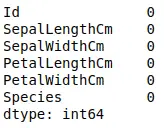
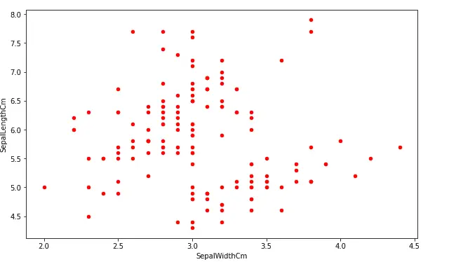
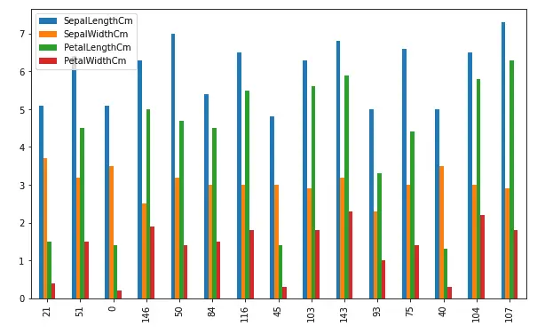

Pandas is an open-source Python module that is commonly used for data analysis and data manipulation. You might have seen some useful methods in Pandas to handle data frames and preprocess the datasets. However, in this article, we will explore some of the powerful methods to visualize data using pandas. We will cover line plots, scatter plots, histograms, area plots, pie plots, and many more.

Table of Contents

- [Exploring the Dataset](#aioseo-exploring-dataset)
- [Visualize Data Using Pandas](#aioseo-visualize-data-using-pandas)
    - [Line plots in Pandas](#aioseo-line-plots-in-pandas)
    - [Scatter plots in Python](#aioseo-scatter-plots-in-python)
    - [Bar plots in Pandas](#aioseo-bar-plots-in-pandas)
    - [Area plots in Pandas](#aioseo-area-plots-in-pandas)
    - [Box plots in Pandas](#aioseo-box-plots-in-pandas)
    - [Pie charts in Pandas](#aioseo-pie-charts-in-pandas)
    - [Density plots in Pandas](#htoc-de)
    - [Hexbin plots in Pandas](#htoc-ha)
- [Summary](#htoc-su)

## Exploring the Dataset

Visualization is an essential tool whether you are analyzing data or preparing it. It is important to learn how to visualize data to see the hidden patterns in the dataset that can be observed by just looking at the numbers. In this article, we will use the famous iris dataset and apply various techniques to visualize the data using the Pandas module. You can download the dataset from [Kaggle](https://www.kaggle.com/datasets/uciml/iris "Kaggle") or can import it directly from either sklearn or seaborn as well.

Before importing import and beginning work on visualization, however, make sure that you have installed the necessary dependencies on your system. You can install the Pandas module using the pip command or using Conda. To set up the starter project for this article, see the article, [Python Data Analysis Starter Project](https://codesolid.com/python-data-analysis-starter-project/).

Now, let us first import the dataset and print a few rows to get familiar with the dataset.

```python
# importing the pandas module
import pandas as pd

# loading the dataset
data = pd.read_csv('Iris.csv')

# heading of data
data.head()
```

Output:


As you can see, we have four input columns and one output column.

Let us now analyze and manipulate the dataset a little bit before going to the visualization part. We can use the unique() method to find all the unique outputs as shown below:

```python
# finding the unique values
data['Species'].unique()
```

Output:


This shows that we have a dataset of three different types of flowers as shown above.

Now, let us check if we have any null values in our dataset by using the isnull() method.

```python
# calculating the null values
data.isnull().sum()
```

Output:



As you can see, there are no null values in the dataset. Now, the final step before starting visualization is to drop the Id column. We don't need it because it is just indexing values.

```python
# dropping the id column
data.drop("Id", axis=1, inplace=True)
```

## Visualize Data Using Pandas

As we know Pandas is a very powerful tool for data analysis. It has many useful methods that play an important role in data preprocessing, manipulation, and feature engineering.

Moreover, although Pandas is not a data visualization tool, it can be used to plot some basic plots that can help us to understand the data more clearly.

In this section, we will learn how to plot the following graphs using the Pandas module

- Line plots

- Scatter plots

- Bar plots

- Histograms

- Area plots

- Box plots

- Pie plots

### Line plots in Pandas

Line Plot is one of the easiest and most basic graphical analysis techniques that play an important role in data analysis when working especially on time series datasets. They are used to express a relationship between two variables.

In Pandas the plot() method is used to plot the line plots of the dataset.

```python
# Plotting line plots in pandas
data.plot()
```

Output:


As you can see, just one line of code in Pandas gives us a beautiful line plot where each input value is colored differently. The reason why there is no plot for the output column is that the output column contains objects, not numeric values.

Sometimes, we may want to plot the dataset with respect to other input values. For example, we will take the sepal width along the x-axis and then plot the rest of the data set.

```python
# plotting fixing the x-axis
data.plot(x= 'SepalWidthCm')
```

Output:


Although the plot is messy, the important thing to note is the x-axis which is now the width of sepals.

Another important feature of Pandas plot method is the subplots. Rather than plotting all the input columns on one plot, we can plot them separately using subplots. The pandas plot() method has an optional argument subplot, and by default its value is false. We can create subplots by specifying the subplot argument to true as shown below:

```python
# creating sub-plots in pandas
data.plot(subplots = True)
```

Output:


As shown above, we got subplots for each of the input values.

### Scatter plots in Python

A scatter plot is a set of points plotted on horizontal and vertical axes. Scatter plots are important in statistics because they can show the extent of correlation, if any, between the values of observed quantities or variables.

Now let us plot a scatter plot of the same dataset using pandas. The scatter() function is used to create a scatter plot as shown below. Notice that we have to specify the y and x axes values explicitly for the scatter plots.

```python
# Scatter plot in pandas
data.plot.scatter(x ='SepalWidthCm', y ='SepalLengthCm')
```

Output:


Similar to any other Python plots, we can change the color and the size of the plots using color and figsize parameters. Let us now increase the size and change the color of the above plot.

```python
# Scatter plot in pandas
data.plot.scatter(x ='SepalWidthCm', y ='SepalLengthCm', figsize=(10,6), c ='r')
```

Output:



As you can see, we have increased the size of the plot and changed the color to red.

Another important plot that we can do using scatter() function is to plot multiple attributes/columns. For example, we will plot a graph comparing the sepals' length, sepals' width, and petals' length.

```python
# creating first scatter plot
ax=data.plot.scatter(x="SepalWidthCm", y="SepalLengthCm", color="r")

# adding one more scattered plot on the same graph
data.plot.scatter(x="SepalWidthCm", y="PetalLengthCm", color="g", ax=ax)
```

Output:


The red dots show the relationship between the width and length of the sepals while the green color shows the relation between the length of the sepals and the petals.

Another important plot that we can do using scatter() method is to color each value differently. This plot is useful when we have categorial values, and we want to know how the values of each category are distributed. In our dataset, the Species column has categorical values, but they are not numeric values. So, before plotting them, we must convert them into numeric values.

There exist many ways to plot and convert the categorical values to numeric values, but here we will use sklearn label encoding method.

```python
# Import sklearn labelencoder
from sklearn import preprocessing
  
# initializing sklearn labelencoder
label_encoder = preprocessing.LabelEncoder()
  
# encoding marrige column
data['Species']= label_encoder.fit_transform(data['Species'])

# dataset
data.head()
```

Output:


As you can see, the categorical values have been converted into numeric values, and each category has been assigned a unique integer value. Now, let us plot the scatter plot and color the points based on the species.

```python
# plotting the scatter plot based on coloring
data.plot.scatter(x="PetalLengthCm", y="PetalWidthCm", c='Species', s=50,colormap='viridis')
```

Output:


As shown above, the scattered plot with different colors for each category helps to see how each category is distributed.

### Bar plots in Pandas

A bar plot is a plot that presents categorical data with rectangular bars with lengths proportional to the values that they represent. A bar plot shows comparisons among discrete categories. One axis of the plot shows the specific categories being compared, and the other axis represents a measured value.

The plot() method in pandas takes an optional parameter 'kind' which specifies the type of plot we want. The default value for kind is a line plot, as we've seen above. We can change it to any other plot as in this section, we will assign bar charts to it.

First, we will create a very simple bar plot for the length of the sepals. But as our dataset is large, we will only take 10% of the overall dataset and plot bar charts for it.

```python
# taking 10% of the data randomly
dataset = data.sample(frac = 0.1)

# plotting bar charts
dataset['PetalLengthCm'].plot(kind='bar', figsize=(10, 6))
```

Output:


The x-axis shows the bars and the y-axis shows the height of each bar. In general, bars are useful to compare categorical values, but because our dataset does not have enough categorical values, we are randomly taking a small portion of the dataset and plotting bar charts.

We can also plot a bar chart for more than one variable and compare their heights. For example, now we will plot a bar chart of all the input variables.

```python
# plotting bar charts
dataset.plot(kind='bar', figsize=(10, 6))
```

Output:



As you can see, this time we have bar charts where each bar with different color represents a different input variable.

Another type of bar chart is the stacked bar chart. It represents the proportional contribution of individual data points compared to the total. The height or length of each bar represents how much each group contributes to the total. For example, let us plot the above plot in the stacked bar chart. By default, the stacked parameter in the bar chart is False, we can plot stacked bar charts by making this parameter True.

```python
# plotting the bar chart
dataset.plot(kind='bar', figsize=(10, 6), stacked=True)
```

Output:


### Area plots in Pandas

An area chart is a graph that combines a line chart and a bar chart to show changes in quantities over time. It's similar to a line graph in that data points are plotted and connected by line segments.

Let us plot the area chart of the dataset using Pandas. The area() method is used to plot the area plots.

```python
# Area plots using Pandas
data.plot.area()
```

Output:


As you can see the lines and the area under the graph are filled with color. By default, the area plots are stacked over one another. We can plot them without stacking as well.

```python
# Area plots using Pandas
data.plot.area(stacked=False)
```

Output:


As shown above, the area plot is not stacked, and the color is transparent so that each graph/area will be visible.

We can also plot the area chart of only single columns as well by specifying the name of the column.

```python
# Area plots using Pandas
data.plot.area(y = 'PetalWidthCm',stacked=False)
```

Output:


### Box plots in Pandas

A box plot is a graphical rendition of statistical data based on the minimum, first quartile, median, third quartile, and maximum. The term "box plot" comes from the fact that the graph looks like a rectangle with lines extending from the top and bottom. A box plot looks like this:


The box plot helps us to find the distribution of the data points. Any data point outside the min and max are considered to be outliers.

Let us plot the box plot of the width of the petals. The box() method is used in Pandas to plot the box plot.

```python
# plotting the box plot
data['PetalWidthCm'].plot.box()
```

Output;


As you can see, there are no outliers in the dataset, and the data is skewed as the median line is not in the middle.

Let us plot the box plots for each of the input values which will help us to compare the distribution of each of the input values.

```python
# plotting the box plot
data.plot.box()
```

Output:


As you can see, there are some outliers in the width of the sepals.

Another way to plot the box plot in pandas is to use the boxplot() method. Using this method, we can plot box plots for each of the output categories which will help us to understand how each of the categories is distributed.

```python
# plotting box plot by categories
data.boxplot(by='Species', figsize=(10, 6))
```

Output:


Similarly, we can also compare the distribution of each of the categories by plotting box plots of the single column only.

```python
# box plot of single column
data.boxplot(column=['PetalWidthCm'], by='Species', figsize=(8, 6), grid=False)
```

Output:


### Pie charts in Pandas

A pie chart is a graphical representation technique that displays data in a circular-shaped graph. It can be used to show percentages of a whole and represents percentages at a set point in time. Unlike bar graphs and line graphs, pie charts do not show changes over time.

The pie() method in pandas plots pie charts. Let us again take 10% of the data and plot a pie chart of the length of the sepals.

```python
# taking 10% of the data randomly
dataset = data.sample(frac = 0.1)

# plotting bar charts
dataset['SepalLengthCm'].plot.pie()
```

Output:


Usually, the pie chart is used to compare categorical values in each of the columns.

To demonstrate this, we will create a random dataset and then will plot different subplots for each of the columns.

```python
# importing numpy
import numpy as np

#creating a DataFrame
Data = pd.DataFrame(np.random.rand(6, 3),
                   columns=('First', 'Second', 'Third'))

# plotting subplots of pie chart
Data.plot.pie(subplots=True, figsize=(10, 6))
```

Output:


### Density plots in Pandas

A density plot is a representation of the distribution of a numeric variable. It uses a kernel density estimate to show the probability density function of the variable. In other words, a density plot is the continuous and smoothed version of the histogram estimated from the data.

Let us first plot the density graph of the length of petals. The density() method in pandas is used to plot the density graph.

```python
# density plot of the dataset
data['PetalLengthCm'].plot.density()
```

Output:


Similarly, we can also plot the density plots of each of the input variables which helps to see the densities of each input value.

```python
# density plot of the dataset
data.plot.density()
```

Output:


As you can see, we now have the density plots for each input value.

### Hexbin plots in Pandas

A HexBin plot is also known as a hexagonal bin plot, and it looks like a honeycomb with different hexagons shaded differently. Each shade corresponds to a value intensity, and the hexagon represents a collection of points. Usually, these types of plots are useful for plotting data on the map.

Let us understand how the hexbin plots work. We assume that we have the following random data.


Hexabin plot is actually a plot of hexagons over the coordinates. For example, see empty hexagons below:


Now if show the above-scattered plot (dataset) is in the form of hexbin plot, each hexagon will have color intensity based on the number of data points in each. If there are no data points in a hexagon, it will disappear. For example see the sample demonstration below:


Now the hexagons that will have more data points will have more intense color while the hexagons with no dataset will disappear in the hexbin plots:


In pandas, the hexbin() method is used to plot the hexbin graphs. Let us plot the hexbin graph of the length and width of the petals.

```python
# haxbin plots using pandas
data.plot.hexbin('PetalLengthCm', 'PetalWidthCm', gridsize=9)
```

Output:


As shown above, we got the hexbin plots where the intensity of the color shows a higher value.

## Summary

Pandas is a powerful open-source Python module that is used for data analysis and manipulation. However, we can also use Pandas for data visualization as well. In this article, we learned how can use Pandas to visualize the dataset in various plots.
