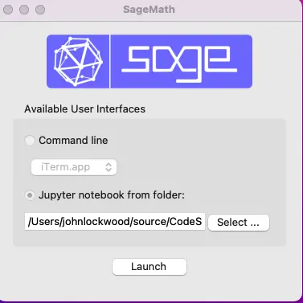
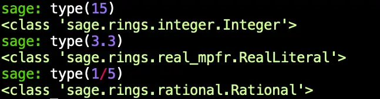
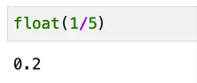

SageMath, sometimes called Sage, is a free, open mathematics software package with the mission of "_Creating a viable free open source alternative to Magma, Maple, Mathematica and Matlab_." In other words, it is a computer algebra system, allowing you to do symbolic math in the same way you might work it out on paper.

In this article, I want to briefly introduce Sage from the point of view of someone who's spent far more time developing and using software than he has doing mathematics. In addition to a high-level overview, I wanted to share some tips and issues I ran into when installing it, the solution to these issues, and ways you can get started online.

Because it's written in Python, working in Sage doesn't require learning a new, proprietary language and allows you to work with familiar tools such as Jupyter. There's also a Sage shell if you prefer a command-line interface, but much like the combination of IPython plus Matplotlib, you can still launch plots with very little work.

Sage is written in Python, but it is not pure Python. Sage is a high-level tool built against over ninety open-source packages -- so it has many Python and non-Python dependencies. These include Maxima (a LISP-based computer algebra system), GAP (which specializes in group theory), PARI (another computer algebra system originally incorporated into Sage for its number theory functionality), and even R for statistical computing. In addition, Sage includes interfaces to use many of these packages and many custom algorithms developed by the Sage community.

## Getting Started With Sage

### Running Sage Online

There are some excellent options for running SageMath online. SageMath.org, for example, hosts a free SageMathCell page that's handy for running short experiments. Let's try our hand at a bit of math, solving a quadratic equation. Minus the comment, this is a one-liner in Sage:


For more extensive work with Sage, you might prefer to create a free account on CoCalc, a commercial Jupyter, Sage, and collaborative development and teaching platform developed by William Stein, Sage's author. CoCalc will give you access to full Sage notebooks and many other [cool features](https://cocalc.com/features). If your needs grow beyond the free account, you can upgrade for a modest monthly or yearly price, depending on how much CPU and disk space you need.

### Installing Sage Math On Your Machine

Before we get into installing SageMath on your machine, let me point out a few caveats up front. Don't let the talk of caveats scare you off too much, though -- I did get Sage installed on my Mac. I also created a nice Docker container for it too, so I know that in Linux, installing it using the combination combination below worked well:

```bash
RUN apt-get update
RUN apt-get install -y sagemath
```

As for Windows, the documented approach in the official [installation guide](https://doc.sagemath.org/html/en/installation/index.html) is to use WSL, so presumably, that approach works well there, too.

Though I was able to get Sage working, there were a few things I tried that didn't work. I realize I should probably spend some time going through those with the Sage community so I can help out in their efforts. For now, let me just note them briefly: I was unable to build SageMath from source on a Mac. (My little Mini is M1 based). In fairness, I used the main branch main instead of grabbing a release tag. On that same machine, I was also unable to get an environment working using MiniConda.

What did work well for me after trying these approaches was to install SageMath using a Mac [binary package](https://github.com/3-manifolds/Sage_macOS/releases) provided by 3-manifolds. After installing this, running the SageMath 9.6 launcher from Launchpad started a Sage tool that you can use out of the box to launch either the SageMath shell or a Sage notebook.



Both options worked just fine from this program, but since I'm more at home at the command line, I wanted to be able to launch `sage` from the terminal to get the Sage shell or `sage --notebook` to run a sage kernel in Jupyter notebook. Doing this was a simple matter of adding this line to the file ~/.zprofile:  
  
`export PATH="$PATH:/Applications/SageMath-9-6.app/Contents/Frameworks/Sage.framework/Versions/Current/venv/bin"`

In general, the Sage terminal is now my first choice for quick experiments in Sage. Here, for example, I define a function and plot it:


You may have noticed two things by this point. First, you'll see that after some false starts, I had to download and install a binary version of Sage. Sage is a non-trivial piece of software so I wouldn't count on "pip install" for it.

Secondly, there are things about the code we've gone over so far that simply wouldn't work in Python; Sage is mathematics software built on Python; it's not just another Python shell.

We'll discuss this theme a bit more in the next section.

## Sage Is "Python With a Twist"

Whether you're using the Notebook version of sage or the terminal program, you'll see several differences between them and a vanilla Python shell, but there are core similarities as well that make working with Sage quite fun for Python programmers.

### How Sage Is Different From Python

- Sage has many, many more built-in functions than Python. Opening up a vanilla Python terminal, if we type `len(dir())` to see what's available before even doing anything, we get 7 things. Of course, a lot of good stuff in Python is in `__builtins__`, which gets resolved automatically, but even there, the number of items is 156. Running `len(dir())` in Sage, on the other hand, returns a value of 1918 as of SageMath 9.6. 
      
    We see one of them in the function definition we showed earlier: `f = x^3 + 4*x + 2`. As everyone's favorite math variable, `"x`" is defined in Sage, it's a sage symbolic expression (an instance of sage.symbolic.expression.Expression), which incidentally is also what f ends up being once we've defined the function that way.  
    
- Numbers and operators sometimes do different things in Sage. Another interesting feature of the last expression is this part of it: `x^3`. The caret operator is an exponent operator in Sage, though `**` also works as it does in Python. In Python, there is such an operator, but it represents the little-used bitwise exclusive or (xor). Thus, 5^3 == 6 in Python, but 125 in Sage! Number literals, too, often have surprising types, as we see in this screenshot:



- Symbols everywhere! Generally speaking, for symbols like pi or for rational expressions, values are displayed in their symbolic form by default (which makes sense for software doing symbolic math). Thus, `1/5` displays as `.2` in a Python console, but remains `1/5` in Sage, unless we explicitly divide it by casting to a float, as shown here in a Sage notebook:



## How Sage And Python Are The Same

Even though Sage is heavily customized, when you're working in Sage, you're still working in an environment based on Python. Because of that, I was able to explore the Sage types using the Python `type()` function and compare the number of builtins using `dir()`. Python types still pop their heads up from time to time (for example, in a list comprehension based on a range, the elements will still be Python ints). Even the xor operator hasn't been stolen from you (not that I would miss it) -- you just need to type two carets instead of one.

If you're a Python programmer, you'll feel right at home using Sage once you get over some initial surprises. As Gregory Bard, the author of "Sage for Undergraduates", wrote on his retro-styled [Sage Related Stuff](http://gregorybard.com/Sage.html) page,

> _If you use Sage in a mathematics, statistics, physics, or data-science class, you will learn Python along the way_. 

I would say the reverse is true, too. For those of us who are already Python programmers, we now can enjoy an environment where we can still do that _and_ play with some beautiful LaTeX-formatted derivatives along the way:


