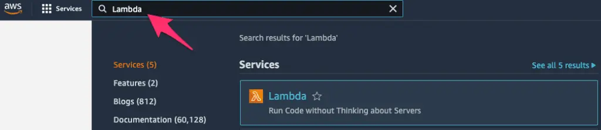
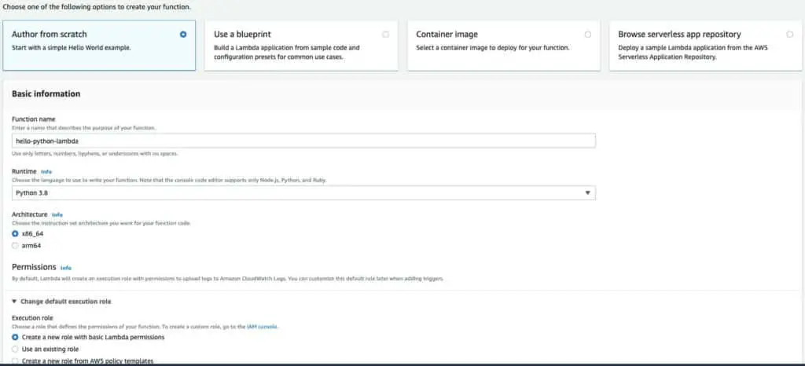
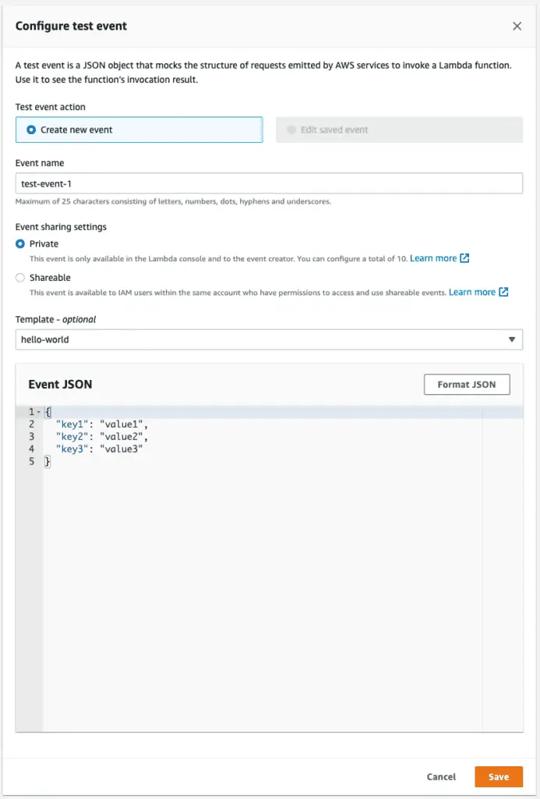
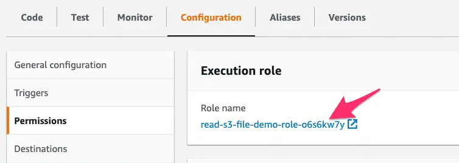
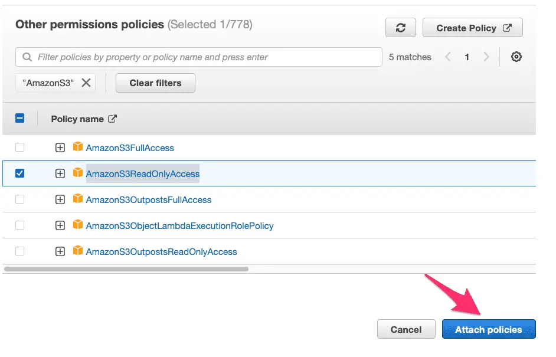

Other than data science and machine learning, I believe the one use case driving the popularity of Python in recent years has been its suitability for serverless cloud computing. Especially for junior developers interested in a role as a Software Developer or DevOps Engineer, I would argue that learning about serverless computing represents a huge potential opportunity if you enjoy working in Python.

On the cloud provider that leads the rest in market share, Amazon Web Services (AWS), serverless computing takes the form of AWS Lambda functions. Developers and DevOps Engineers call on Lambda functions to provide functionality that doesn't require a long-running process. For example, they can serve as API endpoints. Even more importantly, AWS Lambda functions serve as "glue functions" Companies doing business on AWS quickly learn that AWS Lambda functions are the most common mechanism to enable customizing AWS Services.

We'll start slowly by listing and defining some basic terms in this article. Once we understand the territory, we can start locally building and running some simple lambda functions. At first, we won't even need an AWS account, but before long, we'll want to sign up for one if we don't have one already. After all, understanding a few simple ways to deploy our functions to AWS is part of working with Lambda functions.

## Some Basic Definitions

Before we begin working with serverless and AWS Lambda functions, let's make sure we understand some basics. The first term that may strike you as unusual is "serverless" -- how can that be? Of course, if we dig deep enough, no computer program is really "serverless." Your code has to run _somewhere_. Marketing-speak like this has led to lots of successful memes and jokes. For example:  
  
"There is no cloud -- it's just someone else's computer."

For serverless, we might coin an equivalent joke:

"Yes, there's a server; it's just not yours."

When we talk about functions that are "serverless," we're talking about a service provided by someone like AWS where:

- We, the customer, don't have to think about, administer, patch, or otherwise care about the server. AWS handles it for us.
- We're [billed](https://aws.amazon.com/lambda/pricing/) only for what we use, at very small increments of time + memory configured. Moreover, AWS provides generous free tier pricing, so unless you're going to go several orders of magnitude beyond what we'll do in this article, you won't pay anything.

So again -- serverless doesn't mean that the server doesn't exist. It means that you, as the user, don't need to think about it.

The second term we should be clear about is "Lambda function." We don't have to spend too much time on this, except to point out that AWS Lambda functions have nothing to do with Python lambda functions. Python lambda functions are anonymous inline functions declared without the def keyword. Often these are used as inputs to other functions, for example:

```python
list(map(lambda x: x * 2, [1,2,3]))
```

Output:

```bash
[2, 4, 6]
```

In the AWS case, "Lambda functions" are a brand name for AWS's implementation of a mechanism to run functions in a serverless way. In my experience, most developers write these in Python, but you could also write them in other languages. Currently, Lambda functions can be written in Java, Go, PowerShell, Node.js, C#, Python, or Ruby. AWS Lambda functions are not anonymous functions.

As we'll see in the next section, they are simple functions written in the target language with specific parameters.

## Creating a Lambda Function (Spoiler: It's Just a Function)

Before we get into the tools needed to deploy our Lambda function to AWS, let's be bold. Let's plow ahead into Lambda functions as if we won't eventually need an AWS account or a command-line tool or anything else. (Because at this stage, we don't).

Open up a file in your favorite text editor, and create a file named lambda\_function.py. Enter this code:

```python
# lambda_function.py
"""lambda function demo"""

import json

def lambda_handler(event, context):
    """lambda_handler is a hello-world lambda function"""
    print('Hello, Lambda!')

    return {
        'statusCode': 200,
        'body': json.dumps('Hello from Lambda!')
    }


if __name__ == "__main__":
    """Demonstrate that this is just a function we can run locally"""
    result = lambda_handler(None, None)
    print(result)
```

Believe it or not, you just wrote your first AWS Lambda function. Now having done that, let's go ahead and run it. Make-believe you're a cloud, go to the console and type:

```bash
python3 lambda_function.py
```

Output:

```bash
Hello, Lambda!
{'statusCode': 200, 'body': '"Hello from Lambda!"'}
```

So now you created an AWS lambda function, and you ran it. I promise you, that's what you did. Admittedly, we cut a few corners -- we didn't run it _**as**_ a Lambda function. We pretended to be a cloud, and then we ran it. So don't add "AWS Lambda Functions" to the skills section of your resume just yet. We should at least run it in AWS first.

When we do publish this Lambda function using the AWS Console, you'll see that it's very similar to the default starter Lambda that AWS will create for you there.

## Getting An AWS Account and Configuring the AWS CLI

You can skip this section if you already have an AWS account and have your AWS command-line tool (the CLI) configured. However, this is a prerequisite for using AWS, so we'll briefly highlight what's involved.

Here's the site to sign up for an AWS account: https://aws.amazon.com. I will let you walk through the process yourself, as signing up for an AWS account requires a credit card. They may hold $1.00 temporarily for 3-5 days "to verify your identity."

You shouldn't be charged for anything you do as part of this demo other than that. AWS provides a free tier for Lambda, under which you get a relatively liberal use of the AWS Lambda service every month for free before it costs anything. You may want to delete the S3 bucket we create because that may cost you a whopping 2.3 cents per month -- other than that, there should be no charge for the whole tutorial.

Once you have an AWS account up and running, you'll likely want to get the AWS Command Line Interface Tool (The "AWS CLI"). AWS has good documentation for how to install it and configure it. You'll need to have done this to work through the section on Publishing a Lambda Function Using the AWS CLI. Before we work through that, let's show how to get it to work "the easy way," using the AWS Console (i.e., the website).

## Publishing a Lambda Function from the AWS Console

Now that we have an AWS account, the easiest -- though least automated -- way to install a lambda function is through the AWS console at [aws.amazon.com](https://aws.amazon.com/). Once you've logged in, the easiest way to navigate to any AWS service is via the search bar on the top. Here we've searched for Lambda:



Clicking on Lambda will bring us to a page where we can create a function. The view may vary if the account is brand new, but you should see a "Create Function" button on the upper right-hand side. Clicking Create Function will bring you to a page where you can easily create a simple Lambda function from scratch.

We select "Author from scratch" in the top row (it should be the default). We give our function a name, and under Runtime, select the latest Python version. We can leave architecture at the default x86\_64. If we do this through the console, AWS will automatically set up an IAM role, or set of permissions, for our Lambda function to use. That should be the default, so we leave it as it is.



Scroll down to the bottom of the page and click Create Function. This will bring you to a page that shows a function that looks like a slightly slimmed-down version of the function we wrote above:

```python
import json

def lambda_handler(event, context):
    # TODO implement
    return {
        'statusCode': 200,
        'body': json.dumps('Hello from Lambda!')
    }
```

Let's look at what else we have available in this view. As we can see in the image below, the top row gives us several options. Among the most useful of these is the Configuration tab, which lets you configure a lambda much more thoroughly than we've done here, including setting environment variables. We also can view Aliases or Versions. At present, we have only one version deployed. If we modify this function and click Deploy on this page, we'll can then go to the Versions tab if we want to Snapshot the new function as a new version.


One feature we can use over and over again, especially as our functions start having more to do, is to test them. From the view above, clicking Test will allow us to create a test event. This will look as shown below. Since we're not processing the event JSON for now, we can leave that field at the default, and enter a name for the event in the EventName field, as shown below:



This will bring us back to the Code source page, and from there, we can click the dropdown next to the "Test" button to test the function, selecting the event we just saved, then click Test. We'll see the functions response and the logs for the run, as shown below:


To get more familiar with this interface, you might try pasting the code we created above in the section "Creating a Lambda Function (Spoiler: It's Just a Function)". Click deploy to deploy a new version and Test again to test it out.

## Publishing a Lambda Function Using the AWS CLI

Once we have the AWS CLI installed and configured for our account, we can also upload our Python Lambda function to AWS" using the CLI. This is slightly more involved than doing it from the AWS console, but it helps us understand some other dependencies. Also, it gives you the background you would need to code it in a CI/CD platform at some point if you needed to do that.

The first thing we need to do is prepare a "build package," consisting of our handler function and any dependencies. At this point, we don't have any dependencies, so let's zip up our build file:

```bash
zip lambda.zip lambda_function.py 
```

Next, we will create an IAM role for the Lambda function to run in. IAM roles are sets of permissions we can apply to resources such as functions or users. Let's create a role with basic permissions. The following code should appear all on one line when copied.

```bash
aws iam create-role --role-name lambda-ex --assume-role-policy-document '{"Version": "2012-10-17","Statement": [{ "Effect": "Allow", "Principal": {"Service": "lambda.amazonaws.com"}, "Action": "sts:AssumeRole"}]}'
```

The output will vary but look something like this. We'll copy the value for "Arn" to the clipboard and use it in the next step.

```bash
aws create-function{
    "Role": {
        "Path": "/",
        "RoleName": "lambda-ex",
        "RoleId": "AROAVJIRR95YUJTABCD",
        "Arn": "arn:aws:iam::36349901212:role/lambda-ex",
        "CreateDate": "2022-03-15T19:18:33+00:00",
        "AssumeRolePolicyDocument": {
            "Version": "2012-10-17",
            "Statement": [
                {
                    "Effect": "Allow",
                    "Principal": {
                        "Service": "lambda.amazonaws.com"
                    },
                    "Action": "sts:AssumeRole"
                }
            ]
        }
    }
}
```

OK, with that, we're ready to create our Lambda function.

Let's look at the whole command first; then, we can discuss the various parts. (One important caveat is that the function name we use below should differ from the function name we used when we deployed a function using the console).

```bash

aws lambda create-function \
    --function-name hello-lambda \
    --runtime python3.9 \
    --zip-file fileb://./lambda.zip \
    --role  <arn_from_when_you_created_role> \
    --handler lambda_function.lambda_handler
```

AWS CLI commands generally follow the format of "`aws <service_name> <operation_name ...parameters`". In this case, we want the lambda service and the create function operation. We give our function a name and tell it to run it using the runtime, python3.9. We need to tell it the location of our zip file, using "fileb:" to indicate that the file is binary. We paste the arn for the role we created earlier for the role. The handler consists of the path to the module (filename) and the function we want to run as a Lambda function.

If that worked, you should see some reasonably long JSON output beginning with the function name and ARN, something like:

```bash
{
    "FunctionName": "hello-lambda",
    "FunctionArn": "arn:aws:lambda:us-east-1:339698421837:function:hello-lambda",
... etc.
```

## Calling a Lambda Function from the Command Line

Although it was a fair amount of work to get our function built and uploaded, much of that work is boilerplate and could be automated. Moreover, invoking our function once we've finished is quite simple. We need a function name and the file name where we'd like to store the functions' output.

```bash
aws lambda invoke --function-name hello-lambda myoutput.txt
```

In addition to the output of the function, which will go to myoutput.txt in this case, we'll also see the result of the AWS CLI call printed to the console, in this case:

```bash
{
    "StatusCode": 200,
    "ExecutedVersion": "$LATEST"
}
```

The 200 status means the function executed successfully. The ExecutedVersion shows that we ran the latest version since we didn't ask to invoke a different one. (In AWS Lambda, earlier versions of a function are generally available unless you remove them explicitly).

If we list the contents of myoutput.txt, we'll see what the function returned to the caller:

```bash
cat myoutput.txt
{"statusCode": 200, "body": "\"Hello from Lambda!\""}
```

You might notice that the line we saw earlier from the print command is not shown. Print commands do not appear as function output; on AWS, they are logged to AWS's logging system, CloudWatch Logs.

## Getting Started with Boto3

All the functions we've been working with so far have been extremely simple demo functions. To work with AWS APIs in any more serious way, however, we need to start working with the boto3 library. Boto3 is an API client library for AWS, so it's how you can connect to and use any AWS service -- whether it's DynamoDB, S3, or a [host of others](https://boto3.amazonaws.com/v1/documentation/api/latest/reference/services/index.html). When we used the AWS CLI earlier to push our Lambda function, we were using a command-line tool written in Python that uses boto3 to call the AWS services on our behalf.

On one level, boto3 is just a Python package, so once you know the name, you already know you can install it with:

```
pip install boto3
```

Let's take a simple example that we can run locally. What we'll do in this example is create an S3 bucket and a local file, then upload the local file to the bucket. We're running this locally because if you're running this example using the AWS CLI credentials on your local machine, you won't have to go through the separate step of making sure your Lamda function execution role has the policies it needs to work with S3.

```python
"""boto3 example that creates an S3 bucket and uploads a file to it"""
# bucket_and_file.py

import boto3

# Globally unique bucket name
# IMPORTANT:  must be unique, not what's set below:
bucket_name = "codesolid-boto-demo-3-22"

def create_bucket(s3):
    """creates and returns the bucket given by bucket_name.  Does not fail if bucket exists"""     
    bucket = s3.Bucket(bucket_name)    
    bucket.create()
    return bucket

def get_test_file():
    """Creates a test file and returns the name"""
    filename = 'testfile.txt'
    with open(filename, 'w') as f:
        f.write('Boto3 rocks!\n')
    return filename

if __name__ == "__main__":    
    # Get an s3 resource, and create our bucket
    s3 = boto3.resource("s3")
    bucket = create_bucket(s3)
    
    # Create a file and upload it
    filename = get_test_file()
    bucket.upload_file(filename, filename)
    
    # Validate that S3 has it by getting the file object
    # from S3 and printing some info about it:
    obj = s3.Object(bucket_name, filename)
    print("S3 file information:")
    print(f"Length: {obj.content_length}")
    print(f"Modified: {obj.last_modified}")
```

There are three things you need to make sure of to run the code listing above:

1. First, make sure you modify the value of bucket\_name in the code, setting it to a value you think nobody else will have. You can add some random characters at the end to ensure this.
2. Make sure you have a virtual environment with boto3 installed.
3. Boto3 has a number of ways to configure itself, but if configured your AWS CLI as we suggested above, including setting a default region, the above code should run ok.

The output I see when I run the code is:

```bash
S3 file information:
Length: 13
Modified: 2022-03-22 20:07:05+00:00
```

## Using Boto3 in a Lambda Function

Now that we have some Boto3 basics in place, let's look at two differences we'll encounter when we try to use it in an AWS Lambda function. We'll notice that for Lambda, we don't need to "pip install" anything for boto3. AWS includes boto3 in the Lambda runtime for Python by default. The other thing that's different is that we won't be running using a privileged local administrator account using our local AWS CLI credentials. Instead, we'll need to specify whatever permissions we need in the Lambda execution role.

The approach we'll take here is to create a new function in the console and apply the permissions we need to the default execution role. This is the simplest way to ensure we already have the permissions we need to write to the CloudWatch logs. It also lets us add the permissions we need for this current example, but it's flexible to handle other use cases we may encounter.

Once again, in the AWS console, we create a new function. Select the "author from scratch" option and the Python 3.9 runtime. For Execution Role, leave the default of "Create a new role with basic Lambda permissions.".


When the function is created, click on the Configuration tab, and select Permissions on the left. At this point, you should see the execution role that was automatically created. Clicking on the role name will let us modify it.



On the next screen under Permissions policies, we want to use the dropdown "Add Permissions" button, and select the menu item for Attach policies


This will bring up a search window where we can type AmazonS3 to find S3-related policies to give our Lambda IAM role permission to read from S3. Looking over the returned list, we can view and select AmazonS3ReadOnlyAccess. Click



At this point, our Lambda function has the permissions it needs, and the function itself is still available in a separate browser tab. We can now modify our function and test it. Click on the Code tab and paste the code below.

```python
"""Lambda function using boto3 to retrieve a file from S3"""
# bucket_and_file.py

import boto3
import io

# Globally unique bucket name
# Must be set to what we created in bucket_and_file.py
bucket_name = "codesolid-boto-demo-3-22"

def lambda_handler(event, context):
    filename = "testfile.txt"
    # Get an s3 resource, and create our bucket
    s3 = boto3.resource("s3")

    # Get the file object    
    obj = s3.Object(bucket_name, filename)

    # Get the file's contents into an in-memory file-like object c.f.
    # https://boto3.amazonaws.com/v1/documentation/api/latest/reference/services/s3.html#S3.Bucket.download_fileobj
    with io.BytesIO() as f:
        obj.download_fileobj(f)
        f.seek(0)
        contents = f.read().decode("utf8")
    
    response = {
        "file_info": {
            "length": str(obj.content_length),
            "last_modified": str(obj.last_modified),
            "contents": contents
        }
    }

    print(response)
    return response
```

After pasting the code, click Deploy to update the function, and click Test to create a test event as we did earlier. Pasted below is the output of our test run.

```
Test Event Name
test-event

Response
{
  "file_info": {
    "length": "13",
    "last_modified": "2022-03-24 12:52:30+00:00",
    "contents": "Boto3 rocks!\n"
  }
}

Function Logs
START RequestId: 4fed7a21-7051-43d0-b2b5-96e36fb53c30 Version: $LATEST
{'file_info': {'length': '13', 'last_modified': '2022-03-24 12:52:30+00:00', 'contents': 'Boto3 rocks!\n'}}
END RequestId: 4fed7a21-7051-43d0-b2b5-96e36fb53c30
REPORT RequestId: 4fed7a21-7051-43d0-b2b5-96e36fb53c30	Duration: 374.47 ms	Billed Duration: 375 ms	Memory Size: 128 MB	Max Memory Used: 74 MB

Request ID
4fed7a21-7051-43d0-b2b5-96e36fb53c30
```

## Final Thoughts

This has been a basic tutorial introduction to Python Lambda functions. Nevertheless, we've covered creating and running them in the console, customizing the IAM execution role they use, using boto3, and many other topics. There's more to Lambda than what we've presented here, including running automated builds using CloudFormation, Terraform, or CI/CD tools like AWS CodeBuild or CodeDeploy. Other topics of interest include working with Python dependencies, dealing with libraries like NumPy with significant C code, or running Lambda functions locally using LocalStack. Please leave a comment if you found this tutorial guide useful, and if there's sufficient interest, we'll get to work on some follow-on articles!

## Further Reading and Advanced Work

Since Lambda functions can be based on custom Docker containers, one fascinating area for creating some advanced Python projects would be in the area of using Python as a wrapper around C or C++ Code. For further background reading on some of the necessary techniques and tools, see the articles [How To Use Docker Python Images and Docker Compose With Python](https://codesolid.com/how-to-use-docker-with-python/) and [Learning C++ and Python](https://codesolid.com/learning-c-and-python-the-perfect-duo-for-success/).

## You May Also Like

- [The Function in Python: Complete Tutorial and Best Practices](https://codesolid.com/the-function-in-python-complete-tutorial-and-best-practices/)
- [Random Python: Secrets and Random Values Made Easy](https://codesolid.com/random-python-secrets-and-random-values-made-easy/)
