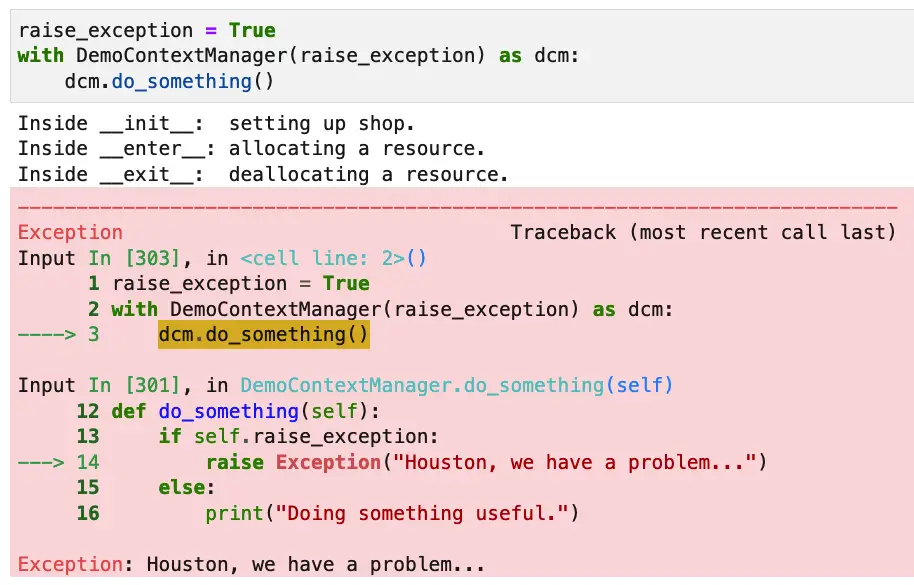

If you're an experienced programmer who started in Python, you're probably at least familiar with the basic uses of the `with` statement. The with statement in Python is an elegant way to manage resources, and is most famously implemented by Python's `open` function. Here's a simple example that prints its own contents and exits.

```python
"""A short program that displays it's own contents"""
with open(__file__, 'r') as f:
    print(f.read())
```

Again, the output of the program is just the contents of the file. The "f" returned by open is a file object, or more accurately in this case, it's of type TextIOWrapper. The with statement requires a code block, and once we exit the code block, Python will automatically close the file.

All of that is well and good -- as I said, we usually learn the basics of the Python `with` statement when we first learn how to open a file in Python. Nothing to see here, right?

Well, as with most of Python's "simple" features, you can look at them in at least two different ways. Of course, you can use the features when you need them on Python classes that already implement them, as we did above in our example. On the other hand, with a little more digging, you can generally find that there's a mechanism you can use to write your own classes in such a way that they look like they "came with" the language.

We saw many examples of this ability to make custom code appear seamless in our discussion of [Python Dunder Methods](https://codesolid.com/dunder-methods-in-python-the-ugliest-awesome-sauce/). Sure enough, we'll be encountering such "magic" methods here as well, along with a Python module, contextlib, that will let us easily create "context managers" (classes that can be used with the "with" statement).

## Basic Features of The With Statement in Python

To understand what's going on under the hood when we use a Python `with` statement, let's begin by comparing what it does at a high level, then get into more detail. Simply put, a `with` statement allows us to ensure that a resource always gets freed. In this way, it gives you a slightly more concise way to handle the allocation and de-allocation of a resource that you'd usually manage in a try and finally block. Earlier we showed a sample program that displays its own source code:

```python
with open(__file__, 'r') as f:
    print(f.read())
```

This longer program also shows off its own code -- but it shouldn't really brag because in this case, the code is longer:

```python
f = open(__file__, 'r')
try:
    print(f.read())
finally:
    f.close()
```

Before getting into other uses of the `with` statement in Python and how you can write custom classes that allow this syntax, let's deal with a question you may have in mind already.

## Handling Exceptions In a With Statement Code Block

When using a `with` statement, the functionality of a try / finally pair comes for free. In terms of the except clause, however, we still need to code this ourselves. An exception can be raised either when evaluating the "with" line itself or during the block of code it controls.

For example, the open function in Python will raise an OSError (FileNotFoundError) when reading a filename that doesn't exist. It will raise some other OSError for other cases (such as trying to open a directory).

In addition, an exception might be raised in the block of the open expression, so it's best to wrap the whole thing in a try block with an except clause, for example:

```python
try:
    with open('not_present.txt', 'r') as f:
        print(f.read())
except OSError as ex:
    print(ex)
```

Output:

```bash
[Errno 2] No such file or directory: 'not_present.txt'
```

Well, who could have predicted that "not\_present.txt" would end up not being present? Filename humor aside, the important thing to remember about the _with_ statement is that the file will be closed even if we don't write an exception handler and an exception is thrown.

## Other Uses of the Context Manager in Python

The Python standard library provides many context manager types that are not only valuable in themselves but also serve as illustrative use cases that help us understand when they're appropriate for our own code. The use cases for Python context managers include:

- Managing resources that need to be closed. We'll look at another example of this.
- Managing shared locks, where the resource is acquired temporarily.
- Managing long-running thread-based contexts where a temporary override might be needed.

### Managing Resources that Need to Be Closed

In the case of resources that need to be closed, the file example we've already looked at is the most common. Let's take another example showing the socket module in use.

To do this, we'll send a simple HTTP request and read only the first few bytes that come back. That should be enough to show the response was successful. We'll handle the request with just a socket, which is definitely "the long way", but it's an interesting example. For an easier-to-use and much more robust implementation, something like urllib or the requests library is definitely preferred as an HTTP client.

he main point for our purposes is that the socket returned by `create_connection` will be automatically closed when the `with` block exits. We can show this by printing the value of the private member, \_close, both within the block and afterward.

```python
import socket

url = "www.w3.org"
port = 80
line_one_length = 17

socket.setdefaulttimeout(3)
with socket.create_connection((url, port)) as sock:  
    # Send an HTTP request, by hand.  Not for production use!
    sock.sendall(b"GET / HTTP/1.1\n")
    sock.sendall(bytes(f"Host: {url}\n", "utf-8"))
    sock.sendall(b"\n")    
    
    # Recieve a one line response
    print(sock.recv(line_one_length).decode("utf-8"))
    
    # We're not closed here
    print(f"Closed in block? {sock._closed}.")

# Now, we will be
print(f"Closed when block exits? {sock._closed}.")
```

Output:

```bash
HTTP/1.1 200 OK

Closed in block? False.
Closed when block exits? True.
```

### Managing Locks in Multi-Threaded Code

Context managers can also be used to automatically manage a thread lock in Python, as an alternative to calling acquire and release. Let's see how we might safely increment a global variable. Of course, once again, there are simpler ways to write our example, but we want to show the use of a with expression with Python locks to show they are implemented as a context manager type.

```python

from threading import Thread, Lock

lock = Lock()

count = 0

def incrementer():    
    global count
    with lock:
        count = count+1        
        print(count)
    sleep(1)
    
# Create some threads
threads = [Thread(target=incrementer) for i in range(0,100)]

for t in threads:
    t.start()

for t in threads:
    t.join()
```

Since `count` is a global resource, we can't assume that we can increment it and use the value correctly within the same thread. (Try this code without the lock and you'll see what I mean).

Instead, we use a Lock object from the threading module to limit this part of the operation to a single thread at any given time. As a result, this code reliably prints the numbers from 1 to 100, in the correct order.

Using a with statement ensures that the lock will be reliably released even if an exception is thrown while using it.

### Temporarily Change a Thread-Local Context

Python's standard library also uses a context manager to temporarily override a thread-local context, specifically, the settings that impact the behavior of the Python Decimal class. The Python Decimal type allows you to do arithmetic on numbers that contain a decimal value that is more precise than the default behavior. CPython's float type is based on the double-precision floating-point values as implemented in C and defined in the [IEEE 754](https://en.wikipedia.org/wiki/IEEE_754) (floating-point) standard. One of the awkward limitations of this standard is that it does not prevent weird rounding issues, even in cases where you wouldn't expect them.

We all know that 1.1 plus 2.7 is 3.8, right? Well, yes and no. Because of the way floating-point numbers behave, here's how it looks in Python:


Python Decimals allow you one way around this, albeit one that relies on a decimal context that allows you to specify how much precision you want to display. In this case, precision includes all the digits involved, so, for example, knowing that we have two-digit numbers to display, we could do this:

```bash
from decimal import *
getcontext().prec = 2
Decimal(1.1) + Decimal(2.7)
```

Now we get a value that's more in line with what we expect to see:

```bash
Decimal('3.8')
```

If your code makes heavy use of the Decimals, however, one problem you may run into is that the context settings you specify as we did above on the line `getcontext().prec = 2` remain in effect for all the code that runs on the current thread. That may not be what you want.

To avoid this, using the `localcontext()` function in a `with` statement, you can use a context manager that will restore the global DecimalContext when the block exits. In the following example, we've indented the output we print inside the with block to make it more clear what's going on:

```python
from decimal import getcontext, localcontext, Decimal

# Reset to default precision (if needed)
getcontext().prec = 28

print(f"1/7 Using high precision: {Decimal(1) / Decimal(7)}\n")

# More code requiring high precision
# ...


# Temporarily narrow the precision with a context manager:
with localcontext() as context:
    print("\tSetting decimal precision on what's returned by localcontext() to 2 in the with block.")
    context.prec = 2
    print(f"\tCalculating 1.1 + 2.7 using low precision: {Decimal(1.1) + Decimal(2.7)}")
    print(f"\tInside the with block, the precision returned by getcontext() is also {getcontext().prec}.\n")

print(f"Outside the block, the precision returned by getcontext() is {getcontext().prec}.")
print(f"1/7 Using high precision: {Decimal(1) / Decimal(7)}\n")

```

Output:

```bash
1/7 Using high precision: 0.1428571428571428571428571429

	Setting decimal precision on what's returned by localcontext() to 2 in the with block.
	Calculating 1.1 + 2.7 using low precision: 3.8
	Inside the with block, the precision returned by getcontext() is also 2.

Outside the block, the precision returned by getcontext() is 28.
1/7 Using high precision: 0.1428571428571428571428571429
```

Understanding the three use cases for context managers in the Python standard library can help inform how you might use context managers in your own code. In summary, we've seen context managers used to automatically close a resource (files and sockets), manage shared resource locks in multithreaded code, and temporarily set a value without impacting the global setting of that value.

Now that we've seen how you use the Python `with` statement on some of the context managers from the Python standard library, let's look at how you can implement context managers on your own custom classes.

## Adding Support for With to Your Classes With a Context Manager

In this section, we want to accomplish two goals:

- First, we want to show you a fully worked "tutorial" context manager that shows how to implement one by hand. This is so we can demonstrate several things about how context managers behave, including where resources are allocated, how exception handling behaves by default, and how you can override the default to implement an exception handler in behavior.
- Second, once we better understand context manager internals, we want to show how you can implement one more easily using the annotations available in the contextlib library.

## A Fully Worked Python Context Manager Example

The following example is somewhat long, but we'll discuss it after the code listing. Meantime, keep an eye out for the context manager itself, which consists of two methods:

- \_\_enter\_\_: This is called on entry to the block of code controlled by with.
- \_\_exit\_\_: This is guaranteed to be called when you exit the block of code controlled by with, whether or not an exception is thrown (or handled).

Here we go:

```python
ffrom contextlib import AbstractContextManager
from threading import Lock

class DemoContextManager(AbstractContextManager):
    
    def __init__(self, raise_exception=False, handle_exception=False):
        print(f"Inside __init__:  setting up shop.")
        self.raise_exception = raise_exception
        self.handle_exception = handle_exception
        self.resource = Lock()
    
    def do_something(self):
        if self.raise_exception:
            raise Exception("Houston, we have a problem...")
        else:            
            print("Doing something useful.")
        
    def __enter__(self):
        print("Inside __enter__: allocating a resource.")        
        self.resource.acquire()
        return self            
    
    def __exit__(self, ex_type, ex_value, ex_traceback):
        print("Inside __exit__:  deallocating a resource.")
        self.resource.release()
        if self.handle_exception:
            """Handle exception internally"""
            print(f"Logging an exception of type {ex_type} with value '{ex_value}'.")
        return self.handle_exception  
```

On line four we declare our class as an implementation of AbstractContextManager. Because Python is [duck-typed](https://docs.python.org/3/glossary.html#term-duck-typing), this is not strictly necessary, but it's a good practice because it documents what we're doing. Inside the `__init__` method we declare two variables that we're using for demo purposes, `raise_exception` and `handle_exception`. We use a lock object to illustrate where to acquire and release the resource, not because this example really needs thread safety.

Of course, our class needs to do something in the code block, so with that hint, we now know where `do_something` (lines 12-16) will go when we use the class. It will dutifully demonstrate an exception raised only if you tell it to when you construct the class.

Lines 18-31 represent the context manager proper, that is, the [dunder methods](https://codesolid.com/dunder-methods-in-python-the-ugliest-awesome-sauce/): `__enter__` and `__exit__`. We use `__enter__` as an opportunity to acquire the lock. The `__exit__` method releases the lock, but we also demonstrate a custom exception handler here using the value `self.handle_exception`.

If `__exit__` returns False (the default in this class), then the exception is bubbled up to the caller. If you want to handle any exceptions inside your context manager class, then you'd return True from `__exit__`. Also, if you don't return a value from \_\_exit\_\_, the exception is also bubbled up to the caller, who then has to handle it as if you returned False. (Recall that if a function returning no value in Python is equivalent to returning None, which is Falsy.)

Most of the code here supports demoing various results. Boiled down to the essentials, what you need for a working context manager are the following things:

- a working `__enter__` method that acquires any resources you need.
- a working `__exit__` method that releases those resources, a return value from `__exit__` that indicates whether you handled the exception (return True) or didn't (return False).

Let's see how this code behaves under various scenarios:

### Using the Defaults With No Exceptions

Here's a short example showing the parts in action, with no exceptions raised:

```python
with DemoContextManager() as dcm:
    dcm.do_something()
```

Output:

```bash
Inside __init__:  setting up shop.
Inside __enter__: allocating a resource.
Doing something useful.
Inside __exit__:  deallocating a resource.
```

As you can see, `__enter__` and `__exit__` are called behind the scenes by the `with` statement. Also, `__init__` was called when we constructed the object, as usual. The only method we called explicitly was `do_something`.

In the presence of an exception, unless we tell the context manager to handle the exception, we get the default behavior, a stack trace. Here's a screenshot showing how it looks in Jupyter Lab:



Notice that even though an exception was raised in `do_something`, the `__exit__` function still ran so the resource was successfully deallocated.

In the next case, we return True from the context manager to indicate that we handled the exception internally.

```python
raise_exception = True
eat_exception = True

with DemoContextManager(raise_exception, eat_exception) as mcm:
    mcm.do_something()
```

Output:

```bash
Inside __init__:  setting up shop.
Inside __enter__: allocating a resource.
Inside __exit__:  deallocating a resource.
Logging an exception of type <class 'Exception'> with value 'Houston, we have a problem...'.
```

Though it's probably what you expect, it's worth noting that as long as it's inside the `with` block, it doesn't matter where the exception occurs. It doesn't have to come from the context manager class code itself -- any exceptions raised in the `with` block will be handled the same way. In other words, `__exit__` will always be called, and depending on that function's return value, the exception will be considered handled or not.

So far we've been implementing context managers "the long way", so we could fully understand the options available and how they behave. In the next section, let's discuss several of the interesting options that are available to simplify context managers in the `contextlib` module.

## Python Context Managers Made Easy With Contextlib

Although writing a context manager by hand can be illuminating, it is somewhat tedious, especially if you have many uses for simple resource closers. The contextlib module provides many easier-to-use solutions, and there are several interesting examples in the [contextlib module documentation](https://docs.python.org/3/library/contextlib.html). I don't want to get into repeating the documentation here wholesale, but I do want to summarize a few points.

First, the module supports the same kind of synchronous context managers we've been dealing with here, as well as something we haven't looked at yet, asynchronous contact managers.

Asynchronous context managers can be used with an "`async with`" expression, to allow things like long io-bound resources to suspend their operation. Their method signatures are declared differently, as shown in the following pseudocode:

```python
async def __aenter__:
     await resource_aquire()
     return self

async def __aexit__():
   await resource_release()
   return False
```

In addition, the contextlib module supports both synchronous and asynchronous context managers via a set of easy-to-use annotations.

Two of these annotations, `contextmanager` and `asynccontextmanager`, are simple decorators that you can use in lieu of a whole class to create a context manager. They both use a simple syntax that uses a generator in the function to be decorated:

> The function being decorated must return a [generator](https://docs.python.org/3/glossary.html#term-generator)\-iterator when called. This iterator must yield exactly one value, which will be bound to the targets in the [`with`](https://docs.python.org/3/reference/compound_stmts.html#with) statement’s `as` clause, if any.
> 
> https://docs.python.org/3/library/contextlib.html#contextlib.contextmanager

To illustrate how easy these are to use here's a basic example that uses pseudocode, for now:

```python
from contextlib import contextmanager

@contextmanager
def managed_resource():
    """A simple context manager in a function"""
    resource_manager = ResourceManager()
    yield resource_manager.allocate()
    resource_manager.free()
```

Here we use the `@contextmanager` annotation on a function, `managed_resource`, and as the documentation requires, we've yielded exactly one resource that will be bound to the target of "as". We've also shown where you would allocate the resource and free it.

What I wanted to show here was how little code is required to do this. But with that, here's a more fleshed-out example that includes the basic idea above along with a lot of print statements to show what's happening in the various parts of the code including the Python `with` statement.

```python
from contextlib import contextmanager

"""A contextmanager decorator example with a ResourceManager class"""

class ResourceManager():
    """A resource manager template you might modify for your needs"""
    def __init__(self):
        self.resource_available = False
        
    def do_something(self):
        if self.resource_available:
            print("\tDid something, the resource was availble.")
        else:
            print("Can't do it, sorry -- resource not availble.")
        
    def allocate(self):
        print("Getting resource")
        self.resource_available = True
        return self
        
    def free(self):
        print("Freeing resource")
        self.resource_available = False        

@contextmanager
def managed_resource():
    """A simple context manager in a function"""
    print("Entering context manager function.")
    resource_manager = ResourceManager()
    yield resource_manager.allocate()
    resource_manager.free()
    print("Exiting context manager function.")

with managed_resource() as managed:
    print("\t---- ENTER WITH -------")
    managed.do_something()
    print("\t---- EXIT WITH -------")
```

Output:

```bash
Entering context manager function.
Getting resource
	---- ENTER WITH -------
	Did something, the resource was availble.
	---- EXIT WITH -------
Freeing resource
Exiting context manager function.
```

## An Asynchronous Context Manager Example

I wrote a basic asynchronous context manager example, and I was able to get it working, but let me issue a few caveats before you go off and rely on it as anything more than a tutorial.

- Asynchronous code in Python becomes somewhat unmanageable quickly because you find that otherwise Pythonic code gets littered with await calls.
- Using this code in "production" would require a lot more testing (not that sqllite3 and "production" really go together anyway). I did get past a lot of the obvious locking issues and the like, so maybe it's not all that bad, but I wouldn't rely on it heavily outside of a tutorial.
- I wanted to use a database example for this case, even if only a local one, but realistically async code is more appropriate to remote databases and other network-bound code. That said, sqllite3 has the advantage of being easier to set up.

OK, with all that apologizing out of the way up front, here's an implementation of a local key-value store in Python that shows off an asynchronous context manager, based on sqllite3.

```python
import sqlite3
from contextlib import asynccontextmanager
from os.path import exists

@asynccontextmanager
async def connect():
    """Manage a filename, closing of the connection, and one time table creation of sqlite3 database.
    
       Yield the connection as an asynchronous context manager-manged object, so it 
       can be used by putvalue and getvalue.
    """
        
    db_file = "keyvalue.db"    
    do_setup = not exists(db_file)
    connection = sqlite3.connect(db_file)

    if do_setup:
        with connection:            
            connection.execute("CREATE table keyvalue(key varchar unique, value varchar)")
    
    yield connection

    connection.close()
    
    
async def putvalue(key, value):
    """Put a value to keyvalue.db's keyvalue table identified by key.  Does an insert or update as needed."""
    lookup = await getvalue(key)
        
    async with connect() as connection:
        if lookup is None:
            connection.execute("insert into keyvalue(key, value) values(?, ?);", [key, value])
            connection.commit()
        else:
            connection.execute("update keyvalue set value = ? where key = ?;", [value, key])
            connection.commit()
    
async def getvalue(key):
    """Retrieves a by key from keyvalue.db's keyvalue table, or None if does not exist."""
    async with connect() as connection:
        with connection:
            cursor = connection.cursor()
            cursor.execute("select value from keyvalue where key = ?;", [key])
            row = cursor.fetchone()
            value = None
            if row:
                value = row[0]
            connection.commit()
            return value
```

Whew! That's a lot for one example. The context manager is handling closing the (underlying) connection here, which the sqlite3's context manager does not take care of. It also manages the one-time setup of a database table that we need. This context manager is consumed by `putvalue` and `getvalue`, our hecka-simple key-value store interface. (Well, it would be hecka-simple if it weren't for the fact that, as I mentioned, async code tends to take over the entire codebase.) It even bubbles out to the client, but as I said, it works OK. Here's a sample session:


## Other Contextlib Utilities

Beyond the generator-based functions, the contextlib module has a lot more interesting decorators and functions that you can use.

For example, here's a simple website-checker I wrote using the closing function, which takes whatever you want to automatically close even if all else goes wrong.

```python
from contextlib import closing
from urllib.request import urlopen
from http import HTTPStatus

with closing(urlopen('https://codesolid.com')) as page:
    status = page.getcode()
    if status == HTTPStatus.OK:
        print("codesolid.com is up and running!")
    else:
        print(f"Unexpected or erro status for codesolid.com. Please check.  Status = {status}.")
```

Needless to say, the site is currently up and running or you couldn't be reading this!

The contextlib module also features an exception suppressor you can use if you know you're not interested in a specific exception.

```python
from contextlib import suppress

def chicken_little():
    raise SystemError("The sky is falling!")

with suppress(SystemError):
    chicken_little()
```

Of course, no discerning codesolid.com reader would ever suppress an exception without a good reason, right? For the rest of the community, the Python documentation includes this "Don't spill hot coffee on your lap" warning label:

> As with any other mechanism that completely suppresses exceptions, this context manager should be used only to cover very specific errors where silently continuing with program execution is known to be the right thing to do.
> 
> https://docs.python.org/3/library/contextlib.html#contextlib.suppress

## Closing Thoughts

As always, I hope you found reading this article to be as interesting as I found writing it to be. Our journey to write a context manager by hand showed us a lot about how context managers behave. The core of it was quite easy to implement, an `__enter__` method that returns a resource, and an `__exit__` method that frees it.

To make things even simpler, the contextlib module makes creating code to work with the Python `with` statement quite easy to do. The contextmanager annotation in that module is especially useful.

## You May Also Enjoy

[Python Format Strings: From Beginner to Expert](https://codesolid.com/python-format-strings/)  
  
[Python Operators: The Building Blocks of Successful Code](https://codesolid.com/python-operators/)

[Python Dataclass: Easily Automate Class Best Practices](https://codesolid.com/python-dataclasses/)

[Python Indexing and Slicing: Complete Tutorial and Hands-On Exercises](https://codesolid.com/python-indexing-slicing-exercises/)

[Random Python: Secrets and Random Values Made Easy](https://codesolid.com/random-python-secrets-and-random-values-made-easy/)
